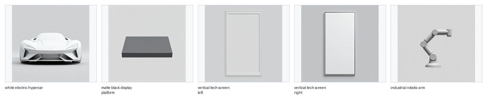
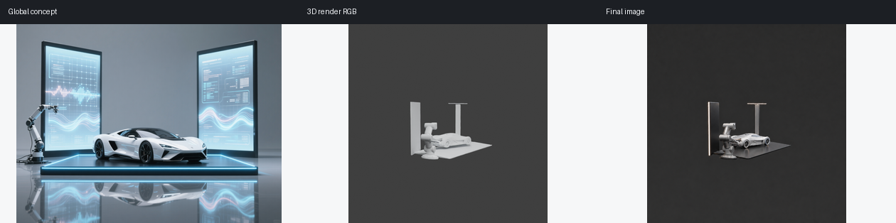
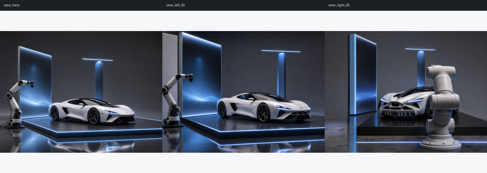
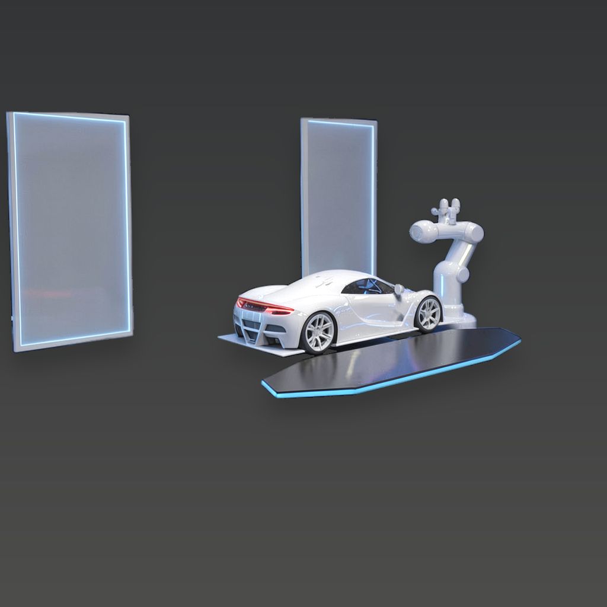

# Harmonize3D

Harmonize3D is a local 3D-to-image rendering workbench. It starts from a real mesh, renders deterministic Blender structure channels, and lets an AI backend generate product-style images that are checked against the original 3D shape.

The current direction is MeshLock-MV: a lightweight mesh-guided Agent for structure-adherent, multi-view AI rendering. The project does not treat the image model as the main invention; the main control layer is the explicit 3D mesh, locked camera, render channels, structure scoring, and multi-view selection loop around the model.

## Paper And Latest Results

Latest paper artifact and source of truth: [`reports/论文.docx`](reports/%E8%AE%BA%E6%96%87.docx).
Rendered PDF generated from the same DOCX: [`reports/论文.pdf`](reports/%E8%AE%BA%E6%96%87.pdf).

Paper title: **Harmonize3D：面向 3D 结构约束与多视图一致性的本地 AI 渲染 Agent**  
Subtitle: **从单对象闭环到模块化全场景生成流程的阶段性研究**  
Author metadata in the paper: 徐洋 / 20300290037 / 计算机科学与技术专业 / 指导教师：徐志平 / 2026 年 6 月

Markdown mirrors generated from the latest DOCX:

- [`docs/harmonize3d_paper.md`](docs/harmonize3d_paper.md)
- [`reports/Harmonize3D_Paper_Deliverable.md`](reports/Harmonize3D_Paper_Deliverable.md)

The paper has been updated with the June 18, 2026 Auto Scene run. This run validates the full modular chain:

```text
concept planning -> module references -> module 3D -> 3D scene assembly -> Blender white-model channels -> final AI render
```

Current status is intentionally tracked through per-stage reports instead of a single unchecked success label. The June 18 run generated 5 Hunyuan3D 2.1 high-profile module GLBs with no procedural fallback and reached a module presence score of `0.855333`, a multiview score of `0.789947`, and a minimum structure review score of `0.551932`. The corrected Codex image2 retry path now preserves all final-render request views instead of only the hero request. `white_model_position_fit` remains a diagnostic preview only: it can write fitted copies under `final/position_fitted`, but it does not overwrite `final_view_*.png` and does not make a result complete. The white-model framing gate now blocks bad camera states before final image2: an earlier side view had bbox `[0.0, 0.251953, 1.0, 0.941406]` and reported `camera_retry_required`; the agent camera retry widened the selected Blender camera and regenerated the white-model channels. The current three-view workdir reports `white_model_position_contract.status=pass` and `framing_review.status=pass`, then accepted a Codex image2 final batch only after the original generated images passed strict `white_model_position_lock`. The accepted final batch has pass rate `1.0`, average total `0.819275`, and per-view totals `0.855849` (`view_hero`), `0.800278` (`view_left_30`), and `0.801699` (`view_right_30`). `final_position_retry_plan` now reports `not_needed` with reason `white_model_position_lock_passed`. Earlier image2 candidates that enlarged/recomposed the scene were rejected and fed back into the next prompts; successful imports now also refresh `contact_sheet.png`, `white_vs_final.png`, and `concept_vs_final.png` so paper assets cannot silently retain stale failed views.

The latest paper image refresh fixes a stale-asset issue: the previous DOCX/PDF still embedded older failed final-render views with grey occlusion artifacts. Paper figures are now synchronized from the current Auto Scene workdir via `scripts/sync_paper_auto_scene_assets.py`, so `docs/paper_assets` and `reports/paper_assets` are both sourced from the same render manifest, original final images, and position-lock reports rather than manually cropped presentation images.










## What It Does

1. Render a mesh through Blender into `rgb`, `depth`, `edge`, `normal`, `mask`, and `skeleton` channels.
2. Generate AI candidates from model-derived channels only.
3. Score candidates with `structure_v2`, which combines silhouette IoU, edge chamfer alignment, added-part penalties, roughness, and background cleanliness.
4. Run the Agent across a locked anchor view and optional left/right views, then choose the best structure and multi-view consistency combination.
5. Produce inspectable artifacts such as `agent_report.json`, `final.png`, `white_vs_final.png`, and multi-view contact sheets.

## Quick Check

```bash
cd /root/sakura/work/Harmonize3D
.venv/bin/python -m pytest -q
```

CPU-safe smoke test:

```bash
PYTHONPATH=src .venv/bin/python -m local3dai.cli sample-renders \
  --output outputs/sample_renders \
  --views 3 \
  --resolution 128

PYTHONPATH=src .venv/bin/python -m local3dai.cli agent-render \
  --input-renders outputs/sample_renders/manifest.json \
  --output outputs/sample_agent \
  --prompt "premium red concept sports car, clean studio product render" \
  --backend mock \
  --max-generations 3
```

## Auto Agent Mode

Auto Agent Mode turns one natural-language request into the full controlled pipeline: task expansion, camera planning, mesh generation or loading, Blender channel rendering, AI candidate search, structure scoring, visual judgement, and final packaging.

CPU-safe smoke test:

```bash
PYTHONPATH=src .venv/bin/python -m local3dai.cli auto-run \
  --request "生成一辆未来感白色电动跑车，做三张产品图" \
  --source-mode procedural \
  --views 3 \
  --quality fast \
  --geometry strict \
  --style product \
  --backend mock \
  --candidates 1 \
  --max-retries 0 \
  --dry-run \
  --output outputs/auto_smoke
```

The run writes `auto_task.json`, `prompt_plan.json`, `camera_plan.json`, `mesh/metadata.json`, `mesh/sanity.json`, `reports/tool_calls.json`, `reports/visual_judgement.json`, `reports/agent_report.json`, `reports/scores.json`, `final/final.png`, `final/white_vs_final.png`, and `final/contact_sheet.png`.

The planner uses an OpenAI-compatible Qwen service. The default configuration points to DashScope `qwen3.7-plus`; credentials and endpoint overrides are loaded from project `.env`:

```bash
DASHSCOPE_API_KEY=...
H3D_AGENT_LLM_BASE_URL=https://dashscope.aliyuncs.com/compatible-mode/v1
H3D_AGENT_LLM_MODEL=qwen3.7-plus
```

Check planner connectivity:

```bash
PYTHONPATH=src .venv/bin/python -m local3dai.cli auto-doctor
```

Optional local vLLM helpers for the previous NVFP4 planner model are still available:

```bash
scripts/download_qwen36_agent_model_direct.sh
scripts/start_qwen36_agent_service.sh
```

The local download helper defaults to `/root/sakura/models/Qwen3.6-35B-A3B-NVFP4`. The start helper mounts `/root/sakura/models` into the vLLM container and automatically uses that local directory when `config.json` exists; otherwise vLLM resolves the model ID through `HF_ENDPOINT=https://hf-mirror.com` with proxy variables removed.

For local-model wiring diagnostics:

```bash
PYTHONPATH=src .venv/bin/python -m local3dai.cli auto-doctor --allow-not-ready
PYTHONPATH=src .venv/bin/python -m local3dai.cli auto-doctor --check-hf-mirror --allow-not-ready
```

The agent exposes controlled tool execution through a fixed local tool list and records every call in `reports/tool_calls.json`. Visual judgement is a required packaging gate; it checks final pixels, comparison/contact-sheet images, white-model position lock, structure scores, multi-view consistency, and concept-aligned camera search evidence before declaring `complete`, `needs_review`, or `failed`.

## Auto Scene Mode

Auto Scene Mode extends the one-object flow into modular scene generation. It expands one request into `scene_plan.json`, `module_plan.json`, a global concept image, per-module reference images, module GLBs, `scene_assembly.json`, an assembled `final_scene.glb`, scene render channels, module scoring, and final geometry-locked AI outputs.

Mock end-to-end run:

```bash
PYTHONPATH=src .venv/bin/python -m local3dai.cli auto-scene \
  --request "生成一个未来汽车发布会展台，中央是一辆白色低趴电动超跑，周围有蓝色灯带、黑色展示台、两块发光屏幕、机械臂和灰色反光地面，输出三张产品级渲染图。" \
  --output outputs/auto_scene/demo_showroom \
  --views 3 \
  --quality fast \
  --geometry strict \
  --style exhibition \
  --backend mock \
  --candidates 1 \
  --max-retries 0 \
  --dry-run \
  --no-llm
```

Blender render smoke run with mock AI output:

```bash
PYTHONPATH=src .venv/bin/python -m local3dai.cli auto-scene \
  --request "生成一个未来汽车发布会展台，中央是一辆白色低趴电动超跑，周围有蓝色灯带、黑色展示台、两块发光屏幕、机械臂和灰色反光地面，输出三张产品级渲染图。" \
  --output outputs/auto_scene/demo_showroom \
  --views 3 \
  --quality fast \
  --geometry strict \
  --style exhibition \
  --backend mock \
  --candidates 1 \
  --max-retries 0 \
  --no-llm \
  --render-backend blender
```

Web/API entry:

```text
POST /api/auto-scene
GET  /api/auto-scene/{task_id}
```

The planner model is loaded from `.env` through the OpenAI-compatible Aliyun Bailian settings (`H3D_AGENT_LLM_BASE_URL`, `H3D_AGENT_LLM_MODEL`, `DASHSCOPE_API_KEY`). Mock mode can skip the LLM with `--no-llm`; real planner mode uses the configured model but still keeps concept and module reference images out of the final AI render inputs. If `concept/global_concept.png` or `modules/<module_id>/reference.png` already exists in the workdir, Auto Scene preserves that image2 asset and records it as `image2_provided` instead of replacing it with the fallback preview generator.

When `reference_generation.provider` is `external_imagegen`, real Auto Scene runs stop at a Codex image2 handoff instead of using a local image fallback. The request JSON declares the exact `output_path`; after generating with Codex built-in image2, import the selected image back into the workdir:

```bash
PYTHONPATH=src .venv/bin/python -m local3dai.cli auto-scene-import-image2 \
  --request outputs/auto_scene/demo_showroom/concept/imagegen_request.json \
  --image /path/to/codex-image2-concept.png
```

For module or final-render batches, pass keyed images such as `--image main_vehicle=/path/to/car.png` or `--image view_hero=/path/to/final.png`, then rerun the same `auto-scene` command. The handoff and import path do not use negative prompts.

If Codex saved the built-in image2 output under `$CODEX_HOME/generated_images`, the latest valid generated image file(s) can be imported without manually copying paths:

```bash
PYTHONPATH=src .venv/bin/python -m local3dai.cli auto-scene-import-latest-image2 \
  --request outputs/auto_scene/demo_showroom/concept/imagegen_request.json
```

For agent-driven runs, use the self-iteration wrapper. It runs Auto Scene, detects pending concept/module/final image2 requests, executes the configured image2 provider, imports the outputs, reruns the same workdir, and repeats through final position-retry requests until the reports settle or `--max-cycles` is reached. If `--image2-provider` is omitted, the loop uses `image2_executor.provider` from config, which defaults to `local_model` in `configs/local.json`. `local_model` / `internal_image2` runs the configured internal image model from `image2_executor.*`: concept and module requests use prompt reference generation, while final and position-retry requests use the Blender white-model render channels and must still pass `white_model_position_lock`. `filesystem_then_codex_latest` first accepts already-written `output_path` images, then scans `$CODEX_HOME/generated_images`. `command` runs `image2_executor.command` from config for each request item, which is the integration point for a separate internal image model service. `mock` is only for smoke tests and requires `--allow-mock-image2`.

```bash
PYTHONPATH=src .venv/bin/python -m local3dai.cli auto-scene-self-iterate \
  --request "生成一个未来汽车发布会展台" \
  --output outputs/auto_scene/demo_showroom \
  --image2-provider local_model \
  --max-cycles 8
```

The loop writes `reports/self_iteration_report.json` and a `live_results` list with absolute image paths plus Codex-ready Markdown image tags for the current concept, module sheet, white channels, final views, and comparison overlays. Codex built-in image2 is still a host tool rather than a normal Python library; when that host writes images to generated_images, the loop can import and validate them automatically, but direct in-process generation requires `local_model`, `command`, or another callable image model backend.

For older runs that already have `renders/render_manifest.json` and `final/final_view_hero.png` but do not yet have the position retry artifacts, backfill the white-model position reports and retry handoff first:

```bash
PYTHONPATH=src .venv/bin/python -m local3dai.cli auto-scene-plan-position-retry \
  --workdir outputs/auto_scene/demo_showroom
```

When `reports/final_position_retry_plan.json` reports `awaiting_codex_image2_retry`, the corrected final-render loop can be resumed from the workdir. The retry request covers every final-render request view that has render-channel inputs, including `view_hero`, `view_left_30`, and `view_right_30` when present. The position-lock report is multiview: if the render manifest has side views but the final package only has a hero image, those side views are reported as missing and the retry handoff is generated. Soft gray Blender/procedural mask channels are thresholded adaptively instead of treating the whole frame as foreground. Retry requests mark `white_model_rgb_position_lock` as the edit target, declare it as a strict paint-over canvas, carry each view's own failed metrics, include a contract margin lock for foreground bbox/empty margins, and attach a `position_contract_measurement_reference` overlay derived from the white-model contract. The few-shot boundary examples then prompt Codex image2 to materialize the existing white-model silhouettes instead of rebuilding a cleaner marketing composition. If the white-model contract itself reports `framing_review.camera_retry_required=true`, the agent first widens the selected camera and rerenders Blender white-model channels; if the framing still fails, the final retry plan returns `camera_retry_required` instead of writing a new image2 retry request. Import commands now run a pre-import position-lock audit for final render and position-retry requests; rejected candidates are copied under `final/codex_image2_import_candidates`, reported in `reports/codex_image2_import_position_audit.json`, and do not overwrite `final_view_*.png`. Successful final/position imports refresh `final/contact_sheet.png`, `final/white_vs_final.png`, `final/concept_vs_final.png`, and summary artifact links from the accepted originals. The command reads the retry request, imports the latest Codex image2 result(s), then reruns the same Auto Scene workdir with the original task options from `auto_task.json`/`auto_scene_summary.json`:

```bash
PYTHONPATH=src .venv/bin/python -m local3dai.cli auto-scene-run-position-retry \
  --workdir outputs/auto_scene/demo_showroom
```

The main Auto Scene packaging path now runs the same generic post-image2 fit stage as a diagnostic preview before final verification. For older workdirs or manual Codex image2 imports, run it explicitly before replanning. This does not create a view-specific hard-coded render; it reads each view's white-model mask bbox and the imported image2 foreground bbox, then writes fitted preview copies under `final/position_fitted`. These previews are not accepted as final renders. Only the original image2 outputs can pass `white_model_position_lock` and become complete:

```bash
PYTHONPATH=src .venv/bin/python -m local3dai.cli auto-scene-fit-position-lock \
  --workdir outputs/auto_scene/demo_showroom

PYTHONPATH=src .venv/bin/python -m local3dai.cli auto-scene-plan-position-retry \
  --workdir outputs/auto_scene/demo_showroom
```

Use `--dry-plan` to print the retry request and handoff without changing files, or `--import-only` when you only want to copy the latest Codex image2 outputs into the retry request before a manual rerun.

If an older/local run produced a final image without `final/codex_image2_final_request.json`, the retry planner now synthesizes that missing request from `reports/white_model_position_contract.json` and `renders/render_manifest.json`, keeping only white-model render channels as final image2 inputs. Synthesized requests keep separate output paths per view, so side-view retries do not overwrite `final/final_view_hero.png`.

Real non-mock runs also package `reports/image2_flow_audit.json`. To rerun the same audit manually after a run advances past module generation:

```bash
PYTHONPATH=src .venv/bin/python -m local3dai.cli auto-scene-audit-image2-flow \
  --workdir outputs/auto_scene/demo_showroom
```

Typical output layout:

```text
outputs/auto_scene/<task>/
  auto_task.json
  scene_plan.json
  concept/concept_image_plan.json
  concept/global_concept.png
  modules/module_plan.json
  modules/module_asset_manifest.json
  modules/<module_id>/reference.png
  modules/<module_id>/model.glb
  modules/<module_id>/sanity.json
  reports/module_mesh_sanity.json
  reports/module_assets_index.json
  final/module_references_contact_sheet.png
  scene/scene_assembly.json
  scene/final_scene.glb
  scene/scene_preview.png
  scene/assembly_report.json
  cameras/camera_plan.json
  renders/render_manifest.json
  reports/white_model_position_contract.json
  final/white_position_contract_overlay.png
  final/final_view_hero.png
  final/white_channels_contact_sheet.png
  final/final_view_left_30.png
  final/final_view_right_30.png
  final/contact_sheet.png
  final/white_position_lock_overlay.png
  reports/module_scores.json
  reports/structure_scores.json
  reports/multiview_score.json
  reports/stages.json
  reports/white_model_position_fit.json
  reports/white_model_position_lock.json
  reports/final_position_retry_plan.json
  reports/image2_flow_audit.json
  reports/agent_report.json
```

## Default Local Setup

The checked-in local config is tuned for this workstation:

- Blender: `tools/blender-5.1.2-linux-x64/blender`
- Default image backend: `flux2-klein`
- Default Agent model key: `flux2_klein_4b`
- Default score version: `structure_v2`
- Default Agent views: `view_locked`, `view_left_30`, `view_right_30`
- Default Agent reference channels: `rgb`, `edge`, `depth`, `normal`, `mask`, `skeleton`

Use `mock` for fast regression tests and UI checks. Use the real configured backends only when the local model weights and GPU environment are ready.

## Main CLI Commands

Render an existing mesh:

```bash
PYTHONPATH=src .venv/bin/python -m local3dai.cli render \
  --model examples/sample_model.obj \
  --output outputs/sample_model/renders \
  --views 3 \
  --resolution 512
```

Run Agent rendering from a render manifest:

```bash
PYTHONPATH=src .venv/bin/python -m local3dai.cli agent-render \
  --input-renders outputs/sample_model/renders/manifest.json \
  --output outputs/sample_model/agent \
  --prompt "premium graphite and white hypercar material, clean studio product render" \
  --backend mock \
  --max-generations 4
```

Run the full scripted workflow:

```bash
PYTHONPATH=src .venv/bin/python -m local3dai.cli run \
  --model examples/sample_model.obj \
  --prompt "photorealistic product render, crisp studio light" \
  --backend mock \
  --workdir outputs/workflow_smoke
```

## Web Workbench

Start the local web app:

```bash
PYTHONPATH=src .venv/bin/python -m local3dai.webapp --host 127.0.0.1 --port 7866
```

Open:

```text
http://127.0.0.1:7866
```

The workbench supports staged operation:

1. Load or generate a 3D white model.
2. Inspect the model in Three.js and lock the current camera.
3. Render Blender white-model channels for that locked view.
4. Generate the final AI render and comparison artifacts.

For an automated UI smoke test, run the server and then:

```bash
H3D_VALIDATE_AI_BACKEND=mock node scripts/validate_web_workbench.mjs
node scripts/validate_auto_agent_web.mjs
node scripts/validate_auto_agent_api.mjs
```

## Z-Image Research Path

The repo contains experimental Z-Image staged ControlNet scripts and reports. The local non-turbo Z-Image plus lite ControlNet path has been validated as loadable, but direct single-view outputs are not yet good enough to become the default Agent backend. Keep it as a candidate generator and keep direct-vs-final reporting enabled.

Useful entry points:

- `scripts/probe_zimage_staged_control.py`
- `scripts/probe_zimage_i2l_lora.py`
- `scripts/run_zimage_i2l_img2img_triview.py`
- `reports/zimage_meshlock_validation_20260614.md`
- `reports/dual_image_staged_weight_research_20260613.md`

## Project Layout

- `src/local3dai/agent.py`: MeshLock Agent search, scoring, multi-view selection, and report output.
- `src/local3dai/scoring_v2.py`: structure-adherence scoring.
- `src/local3dai/ai/backends.py`: mock, Diffusers, SDXL ControlNet, Flux2 Klein, and HiDream backend adapters.
- `src/local3dai/ai/geometry.py`: mesh position/detail/adaptive/quality lock compositing helpers.
- `src/local3dai/workflow.py`: reusable end-to-end workflow.
- `src/local3dai/webapp.py`: staged local API and web workbench server.
- `blender_scripts/batch_render.py`: Blender channel rendering.
- `web/`: static Three.js workbench UI.
- `reports/`: technical reports and validation notes.

## Reports

The current technical report artifacts live under `reports/`, including:

- `reports/Harmonize3D_Technical_Report.pdf`
- `reports/Harmonize3D_完整技术报告_20260622.md`
- `reports/Harmonize3D_完整技术报告_20260622.html`
- `reports/Harmonize3D_完整技术报告_20260622.pdf`
- `reports/论文.docx`
- `reports/论文.pdf`
- `reports/harmonize3d_technical_report_content.json`
- `reports/flux2_staged_weight_matrix_20260613.md`
- `reports/zimage_meshlock_validation_20260614.md`
