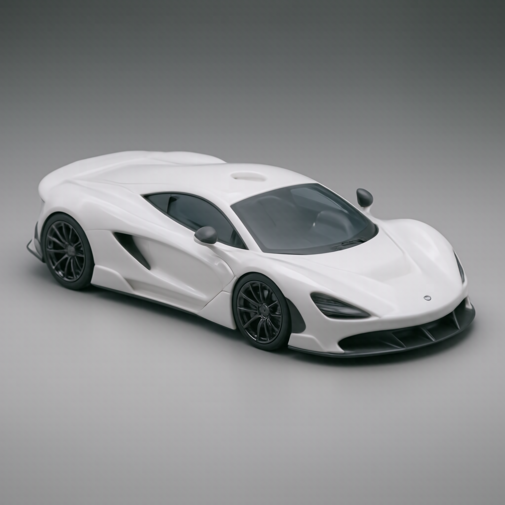
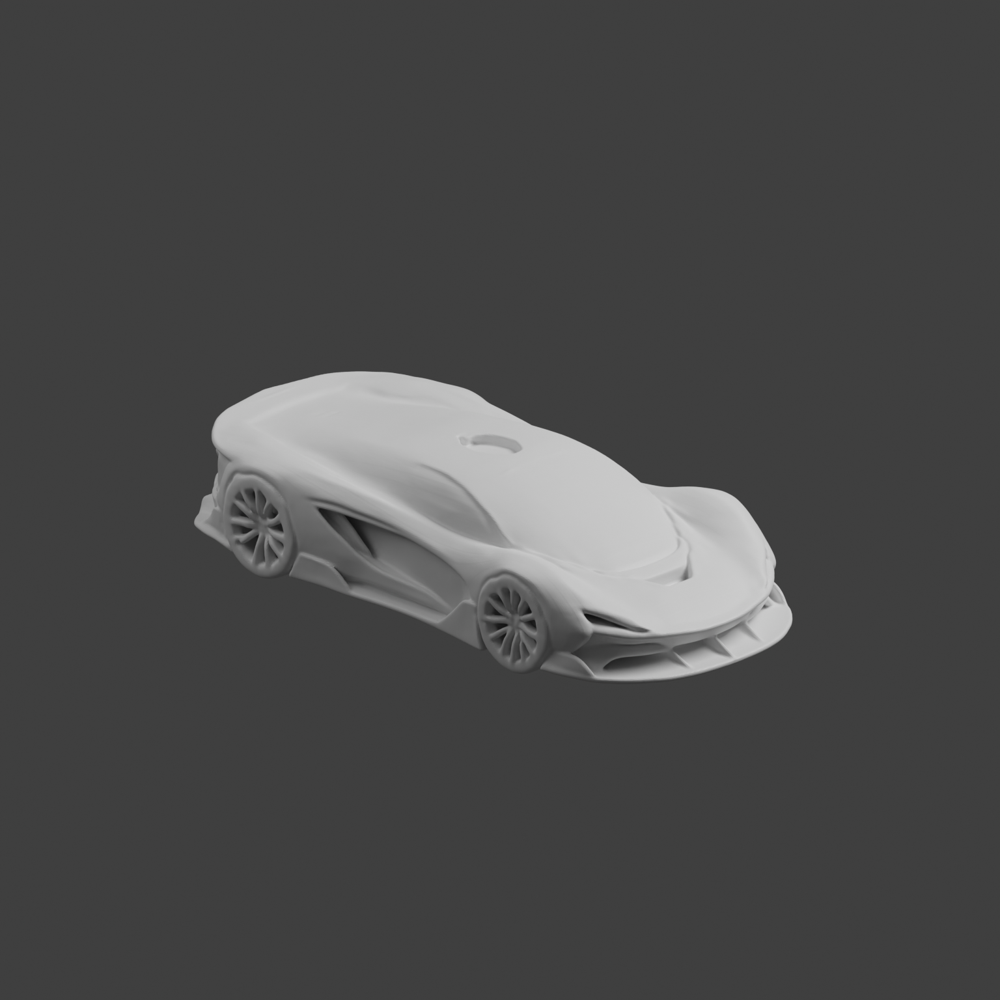
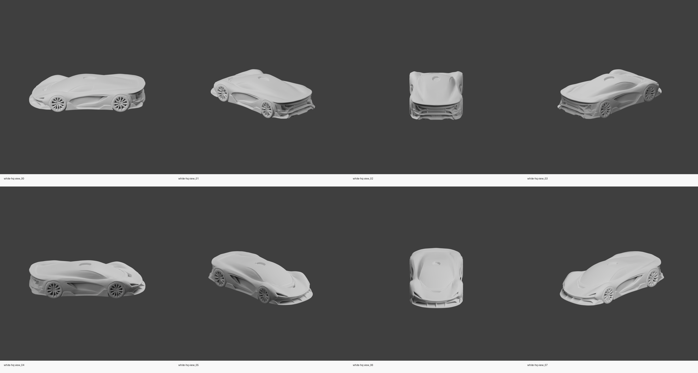
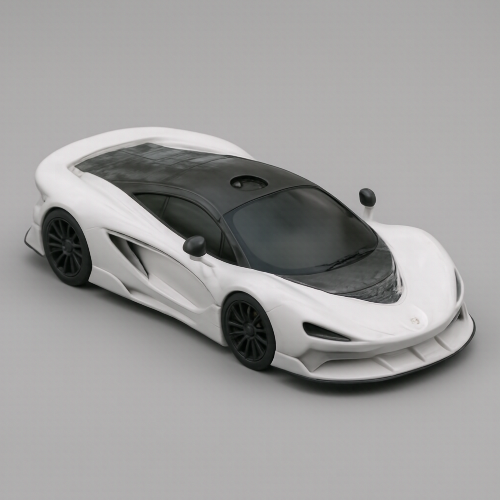
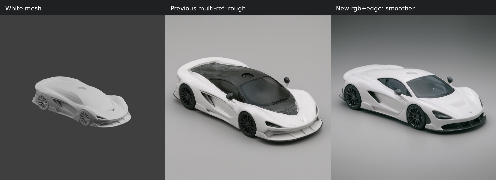

# Harmonize3D 项目完整报告

生成日期：2026-06-11  
项目根目录：`/root/sakura/work/Harmonize3D`  
远端仓库：`git@github.com:adkeb/Harmonize3D.git`

## 1. 摘要

Harmonize3D 是一个本地化的 3D 到 AI 成品渲染系统。系统目标不是单纯生成一张好看的图片，而是从 3D 白模出发，在尽量尊重原始模型几何约束的前提下，生成高质量、高分辨率、材质完整、视觉干净的最终成品渲染图。

本次工作完成了以下核心内容：

- 建立本地工程结构，提供 CLI、Web 控制台、Blender 批量渲染、AI 后端、评分与报告产物组织。
- 使用 Hunyuan3D 2.1 进行图生 3D，生成高模数跑车白模。
- 使用 Blender 生成多视角白模通道：`RGB / Depth / Edge / Normal / Mask`。
- 接入 SDXL ControlNet 与 HiDream-O1-Image full 两类图像渲染后端。
- 将最终图像渲染模型切换到 HiDream-O1-Image full，并按官方运行环境修正 `transformers==4.57.1`。
- 在不走 VPN 流量的前提下，使用 Hugging Face 镜像站直连下载模型权重。
- 通过多轮 prompt 和参考通道实验，将最终结果从粗糙、有噪点的多参考图，优化为更干净、更接近产品渲染的 `rgb + edge` 几何约束结果。
- 将项目初始化为 Git 仓库并推送到 GitHub，提交内容排除了 87GB 级别的本地模型、虚拟环境和输出目录。

最终最佳图像为 `2048 x 2048`，使用 HiDream-O1-Image full、`50 steps`、`guidance_scale=2.2`、`shift=3.0`，参考图只使用白模 `RGB` 与 `Edge`。该策略相较 `RGB + Edge + Depth + Normal` 多参考方案显著降低了车身和背景上的粗糙纹理、噪点、污渍感。



## 2. 项目目标与约束

项目最初目标是按照本机配置，构建一个可以完整跑通的本地 3D AI 渲染系统。后续目标逐步收敛为：

- 3D 阶段使用 Hunyuan3D 2.1，且尽量生成高质量、高模数白模。
- AI 渲染阶段不采用 paint 式贴图，而是从白模图像出发，用图像模型直接渲染成成品图。
- AI 渲染必须尊重原白模几何，不应自由改写车身比例、轮位、开孔、前铲、车顶轮廓等结构。
- 调参阶段不一上来跑全量多视角，而是先用单视角做 prompt 和参数调优，效果好后再扩展。
- 模型下载必须通过 Hugging Face 镜像站直连，避免消耗 VPN 流量。
- 最终结果不以“酷炫”为唯一目标，更重要的是质量高、干净、保形、材质合理。

最终系统实现围绕这些约束展开：先通过 Hunyuan3D 2.1 得到白模，再用 Blender 输出结构参考通道，最后用 HiDream-O1-Image full 做受控图像编辑式渲染。

## 3. 本地环境与资源

本机环境按 `configs/local.json` 记录，核心配置如下：

| 项目 | 配置 |
|---|---|
| 操作系统 | WSL2 Ubuntu 22.04 |
| GPU | NVIDIA GeForce RTX 5090 D |
| 显存 | 约 32GB |
| NVIDIA Driver | 610.47 |
| CUDA Runtime | 13.3 |
| Python 环境 | `.venv`，由 `uv` 管理 |
| Blender | `tools/blender-5.1.2-linux-x64/blender` |
| 3D 模型生成 | Hunyuan3D 2.1 shape |
| 图像渲染 | HiDream-O1-Image full，SDXL ControlNet 作为早期几何约束后端 |

权重下载时使用直连环境变量，避免代理和 VPN：

```bash
unset HTTP_PROXY HTTPS_PROXY ALL_PROXY http_proxy https_proxy all_proxy
export NO_PROXY='*' no_proxy='*'
export HF_ENDPOINT='https://hf-mirror.com'
export HF_HUB_DISABLE_XET=1
```

HiDream-O1-Image full 权重保存在本地 `models/HiDream-O1-Image`，大小约 33GB。该目录被 `.gitignore` 排除，不进入 Git 仓库。

## 4. 工程结构

项目采用 Python 包和脚本混合组织，核心目录如下：

| 路径 | 作用 |
|---|---|
| `src/local3dai/cli.py` | 统一命令行入口，提供 `doctor / init / generate-3d / render / ai-render / score / run` 等命令 |
| `src/local3dai/workflow.py` | 可复用工作流编排，串联 Hunyuan3D、Blender、AI 渲染、评分和对比图 |
| `src/local3dai/ai/backends.py` | AI 图像后端实现，包括 mock、Diffusers、SDXL ControlNet、HiDream-O1-Image full |
| `src/local3dai/ai/geometry.py` | 几何锁定、Canny 控制图、白模与 AI 图对比图工具 |
| `src/local3dai/rendering/blender.py` | 调用 Blender 后台脚本批量渲染 |
| `blender_scripts/batch_render.py` | Blender 内执行的模型导入、归一化、相机、灯光、多通道输出逻辑 |
| `src/local3dai/scoring.py` | 基于边缘 F1 和遮罩 IoU 的候选评分与排序 |
| `configs/local.json` | 本机路径、模型、渲染与 AI 参数配置 |
| `web/` | 本地 Web 控制台前端 |
| `scripts/` | 模型下载、环境安装、Hunyuan3D 调用、对比图制作等辅助脚本 |
| `docs/` | 本报告与报告图片资产 |

Git 仓库只提交源码、配置、脚本、报告和少量示例资源。以下目录被排除：

- `.venv/`
- `.venv-hy3d/`
- `models/`
- `outputs/`
- `tools/` 中除 `tools/hfd.sh` 外的第三方下载仓库和二进制文件

这样做可以避免把数十 GB 的模型权重、生成图和 Blender 包推送到 GitHub。

## 5. 系统总体工作流程

Harmonize3D 的核心流程可以概括为：

```text
输入提示词或参考图
        |
        v
Hunyuan3D 2.1 图生 3D 白模
        |
        v
Blender 多视角、多通道渲染
        |
        +--> RGB
        +--> Depth
        +--> Edge
        +--> Normal
        +--> Mask
        |
        v
AI 图像模型渲染
        |
        v
结构一致性评分与人工视觉筛选
        |
        v
最终成品图与白模对比图
```

其中最关键的设计点是：AI 渲染不直接从纯文本生成跑车，而是使用白模渲染图和结构通道作为参考输入。这样可以让最终图继承原始 3D 形体，而不是变成模型凭先验生成的一辆全新跑车。

## 6. 3D 白模生成

3D 阶段使用 Hunyuan3D 2.1 shape 模型。最终采用的是图生 3D 方式，即先生成跑车参考图，再将参考图输入 Hunyuan3D 2.1，输出 `.glb` 白模。

最终白模生成参数记录如下：

| 参数 | 值 |
|---|---|
| 模型 | Hunyuan3D 2.1 shape |
| 输入图 | `outputs/sportscar_best/image2_reference/hypercar_reference_clean_square.png` |
| 输出模型 | `outputs/sportscar_best/image2_final/white_mesh_hunyuan21_image2_best.glb` |
| steps | 85 |
| guidance_scale | 5.4 |
| octree_resolution | 512 |
| num_chunks | 200000 |
| seed | 2026061502 |
| 顶点数 | 530,715 |
| 面数 | 1,061,684 |
| 运行耗时 | 约 81.6 秒 |
| 最大显存占用 | 约 12.1GB |

这个白模自身包含跑车的主要结构：低趴车身、前铲、轮拱、四轮、车顶舱盖、侧进气口、机盖开孔与整体车身轮廓。后续 AI 渲染的核心要求，就是在这些结构基础上添加材质、玻璃、轮胎、灯光和产品摄影质感。

白模单视角：



白模多视角：



## 7. Blender 通道渲染实现

Blender 阶段由 `blender_scripts/batch_render.py` 实现，设计重点是把任意 `.glb / .gltf / .obj / .fbx` 模型标准化为可用于 AI 控制的多通道图片。

主要实现细节：

1. **模型导入**  
   `import_model()` 根据扩展名选择 Blender 对应导入器，支持 `.glb/.gltf/.obj/.fbx`。

2. **模型归一化**  
   `normalize_model()` 遍历所有 mesh 的包围盒，计算中心点和最大尺寸，将模型中心移到原点附近，并缩放到统一尺度。这样不同模型都能落在相机视野内。

3. **场景配置**  
   `configure_scene()` 设置 Cycles 渲染器、分辨率、采样数、PNG 输出、Film/World 背景与色彩管理。

4. **正交相机**  
   `make_camera()` 使用正交相机，避免透视夸张，保证白模通道更适合作为结构参考。

5. **多视角环绕**  
   `render_view()` 按视角角度移动相机，生成 `view_00` 到 `view_07` 等多个视角。

6. **通道输出**  
   每个视角输出：

   - `rgb.png`：正常白模渲染。
   - `depth.png`：基于 Camera Data 的深度伪彩图。
   - `edge.png`：Freestyle 轮廓线。
   - `normal.png`：法线方向编码。
   - `mask.png`：白色前景遮罩。

这些通道被写入 `manifest.json`，供后续 AI 渲染和评分读取。

## 8. AI 渲染后端实现

项目中实现了多个 AI 后端：

- `MockImageBackend`：用于无模型情况下测试全流程。
- `DiffusersImageBackend`：用于通用 Diffusers 图生图。
- `SDXLControlNetGeometryBackend`：使用 SDXL Base + Canny/Depth ControlNet，早期用于几何约束渲染。
- `HiDreamO1ImageBackend`：最终接入 HiDream-O1-Image full。

HiDream 后端的关键实现位于 `src/local3dai/ai/backends.py` 的 `HiDreamO1ImageBackend`。

它的核心逻辑是：

1. 从 `configs/local.json` 读取 `repo_root`、`local_path`、`model_type`、`shift`、`reference_channels`。
2. 将官方 HiDream-O1-Image 仓库加入 `sys.path`。
3. 使用官方 `inference.py` 中的 `add_special_tokens`、`get_tokenizer` 和 `models.pipeline.generate_image`。
4. 使用 `AutoProcessor.from_pretrained(..., local_files_only=True)` 和 `Qwen3VLForConditionalGeneration.from_pretrained(..., local_files_only=True)` 本地加载权重。
5. 对每个视角，从 manifest 中取出指定参考通道，例如 `rgb` 和 `edge`。
6. 调用官方 `generate_image()`，传入 prompt、参考图、尺寸、steps、guidance、shift 和 seed。
7. 将生成图保存为 `candidate_00.png`，并写出 AI manifest。

最终配置如下：

```json
"hidream_o1_image_full": {
  "backend": "hidream-o1-image",
  "repo_root": "/root/sakura/work/build/tools/HiDream-O1-Image",
  "local_path": "/root/sakura/work/build/models/HiDream-O1-Image",
  "model_type": "full",
  "enabled": true,
  "width": 2048,
  "height": 2048,
  "steps": 50,
  "guidance_scale": 2.2,
  "shift": 3.0,
  "reference_channels": ["rgb", "edge"]
}
```

注意：配置中的绝对路径仍保留旧目录名 `/root/sakura/work/build`，这是项目改名后的历史遗留项。当前文件实际位于 `/root/sakura/work/Harmonize3D`。后续建议将配置路径刷新为新根目录，或者改成相对路径，以便迁移。

## 9. HiDream-O1-Image full 接入过程

HiDream-O1-Image full 接入过程中遇到并解决了两个关键问题。

### 9.1 模型下载

HiDream-O1-Image full 权重从 Hugging Face 镜像站下载到本地，下载时显式关闭代理，避免走 VPN 流量。

模型目录大小约 33GB，包含 8 个 safetensors 分片。下载后对分片大小进行校验，确认没有 `.incomplete` 残留。

### 9.2 transformers 版本兼容

一开始使用当前环境中的 `transformers 5.10.2` 加载模型，出现 `KeyError: 'default'`，原因是该版本的 `ROPE_INIT_FUNCTIONS` 不再包含 HiDream 官方代码需要的 `default` RoPE 键。

最初尝试过兼容补丁，但随后按要求改回“遵从官方原版代码运行”，最终将环境切换到 HiDream 官方要求的：

```text
transformers==4.57.1
```

切换后官方 Qwen3VL 文件可以保持原版，不再需要 RoPE 兼容补丁。

### 9.3 flash-attn 处理

本机环境没有安装 `flash_attn` 或 `flash_attn_interface`。因此保留官方 README 推荐的无 flash-attn 运行方式，将 HiDream 官方 `models/pipeline.py` 中 `use_flash_attn` 调整为 `False`。这属于官方允许的兼容运行路径，保证在当前环境可以正常推理。

## 10. Prompt 与参数迭代

本项目最终效果不是一次生成得到的，而是多轮 prompt、参考通道和参数组合调出来的。

### 10.1 早期 SDXL ControlNet 阶段

早期使用 SDXL Base + Canny/Depth ControlNet，优点是几何约束更直接，缺点是材质真实感和最终画面质量有限，容易出现白模感、暗部过重、局部边缘噪声等问题。

这个阶段主要用于验证：

- 白模渲染通道有效。
- Canny/Depth 可以约束大轮廓。
- 单视角调参比一次性跑 8 个视角更高效。
- 长 prompt 能改善材质描述，但也会增加模型对结构的自由改写。

### 10.2 HiDream 单 RGB 参考阶段

切换到 HiDream-O1-Image full 后，先使用单张白模 RGB 作为参考。模型能够跑通，而且画面质量明显高于 SDXL ControlNet，但初始结果过于自由：

- 会把白模跑车改造成真实赛车。
- 会添加尾翼、贴纸、文字、后视镜等原模型中没有的结构。
- 背景会偏真实摄影场景，和白模灰背景差距过大。

该阶段说明：HiDream full 的生成能力强，但如果只给单 RGB 白模和偏“跑车摄影”的提示词，它会强烈调用真实超跑先验，导致保形不足。

### 10.3 RGB + Edge + Depth + Normal 多参考阶段

为了加强几何约束，随后尝试将 `rgb / edge / depth / normal` 四个通道都作为 HiDream 参考图。该策略显著改善了结构一致性：

- 不再明显添加尾翼。
- 贴纸和文字减少。
- 车身轮廓、前铲、侧进气口、轮位更接近白模。

但缺点也很明显：模型会将 `depth` 和 `normal` 图中的明暗、方向纹理误读成真实材质纹理，导致车顶、前盖和背景出现明显粗糙感、块状噪点、脏污纹理。

上一版多参考结果：



### 10.4 RGB + Edge 平滑正向提示阶段

最终采用 `rgb + edge` 两参考策略。理由如下：

- `rgb` 提供白模体积、光照和基本视角。
- `edge` 提供轮廓和关键硬边约束。
- 去掉 `depth/normal`，避免模型把结构通道误读为粗糙贴图。
- prompt 从“不要噪点、不要污渍、不要划痕”改为正向描述，比如 `factory-new`、`spotless`、`smooth`、`pristine`、`premium configurator render`。这是因为否定词中的“污渍、划痕、噪点”有时反而会触发模型生成这些视觉元素。

最终提示词如下：

```text
Instruction-based automotive materialization using two references. Reference 1 is the exact 3D clay car and camera. Reference 2 is the edge guide for the same car. Render the same vehicle as a factory-new high-end CGI product image. Preserve the exact low wide silhouette, wheel placement, front splitter, hood opening, side intakes, canopy shape, rear deck, panel flow, smooth blank body panels, camera angle, and studio framing. The finish is immaculate and refined: seamless pearl white ceramic automotive paint, smooth glossy clearcoat, soft broad studio reflections, clean smoke-gray glass in the canopy and window areas, deep satin charcoal tires, elegant dark metallic wheels, simple spotless neutral gray studio floor, quiet gradient studio background, softbox lighting, premium configurator render, clean antialiased edges, smooth continuous surfaces, polished showroom quality. The design remains minimal and unbranded, with no racing theme and no added aerodynamic accessories.
```

最终参数如下：

| 参数 | 值 |
|---|---|
| 模型 | HiDream-O1-Image full |
| 参考图 | 白模 `rgb.png` + `edge.png` |
| width / height | 2048 / 2048 |
| steps | 50 |
| guidance_scale | 2.2 |
| shift | 3.0 |
| seed | 2026061908 |
| 输出图 | `docs/assets/final_smooth_rgbedge.png` |

## 11. 最终效果

最终效果图如下：


白模、上一版和最终版对比：



从对比图可以看到：

- 最终版相较多参考粗糙版，车身白漆更平滑，车顶和前盖不再有明显脏纹理。
- 背景从粗糙灰面变成更接近产品配置器的柔和灰色背景。
- 轮廓、车身姿态、前铲、侧进气口和整体低趴比例仍然保持在白模约束范围内。
- 最终图质量更接近“产品渲染”，而不是“旧模型摄影”或“脏污赛车图”。

仍然存在的不足：

- HiDream 会根据超跑先验添加后视镜，这不是原始白模中的显著结构。
- 车灯、前脸与轮毂会被模型合理化为真实跑车细节，严格几何保真仍不如传统 ControlNet 或 3D 材质渲染。
- 最终图虽然干净很多，但局部细节仍是图像模型生成结果，不是可回写到 3D mesh 的真实材质。

综合判断：当前最终图在“画面质量、平滑程度、产品渲染感、与白模结构一致性”之间达到目前最好的平衡。

## 12. 评分与一致性策略

项目中实现了结构评分器 `src/local3dai/scoring.py`，其目标是从多个候选中自动挑出更接近白模的图。

评分由三部分组成：

| 分数 | 含义 |
|---|---|
| `edge_f1` | 白模边缘图与候选图边缘图的 F1 相似度 |
| `mask_iou` | 白模 mask 与候选图前景 mask 的 IoU |
| `prompt_proxy` | 当前为固定代理值，预留给后续 CLIP 或 VLM prompt 对齐评分 |

默认权重：

```json
{
  "edge_weight": 0.55,
  "mask_weight": 0.25,
  "prompt_weight": 0.2
}
```

这个评分器对 SDXL ControlNet 多候选阶段较有用；在 HiDream 调优阶段，由于每次只跑一个候选，更多依赖人工视觉判断。但评分器仍然保留在工程中，后续如果扩展到多 seed 或多视角一致性筛选，可以继续使用。

## 13. Web 控制台

项目包含一个本地 Web 控制台，前端位于 `web/`，后端入口为 `src/local3dai/webapp.py`。它用于把命令行流程包装成浏览器界面，便于选择模型、上传参考图、运行流程、查看白模、查看最终图和对比图。

启动命令：

```bash
local3dai-web --host 127.0.0.1 --port 7866
```

设计上 Web 控制台调用的是同一套 workflow API，因此不另写一套逻辑，避免 CLI 与 Web 行为不一致。

## 14. Git 与交付状态

项目已经初始化 Git 仓库并推送：

```text
remote: git@github.com:adkeb/Harmonize3D.git
branch: main
commit: e964fcb Initial Harmonize3D project
```

提交内容总量约 300KB，包含 39 个源码、配置、脚本和文档文件，不包含本地模型权重、输出图、虚拟环境和第三方下载仓库。

本报告生成后，`docs/` 下新增报告源文件和图片资产。建议后续将报告提交为第二个 commit。

## 15. 关键经验总结

这次实现中最重要的经验有四点：

1. **强模型不等于强保形**  
   HiDream-O1-Image full 的视觉质量明显强，但如果约束不足，它会按照真实跑车先验自由改写白模。

2. **参考通道不是越多越好**  
   `depth` 和 `normal` 确实能提供几何信息，但在 HiDream 的图像编辑范式里，它们也可能被当作材质纹理，导致粗糙感和噪点。

3. **负面词可能反向触发**  
   在清洁修复阶段，直接写“remove dirt/noise/scratches”并不稳定，模型反而可能把这些概念画出来。最终更有效的是正向描述“factory-new、spotless、smooth、pristine”。

4. **单视角渐进调优是正确策略**  
   如果一开始跑 8 视角、全分辨率、多候选，会浪费大量时间。最终先用 view_05 单视角调 prompt、参考通道和 guidance，再确定最佳策略，是更高效的路线。

## 16. 后续改进方向

下一步可以从以下方向继续提升：

- 将 `configs/local.json` 中旧的 `/root/sakura/work/build` 路径刷新为 `/root/sakura/work/Harmonize3D` 或相对路径。
- 给 HiDream 后端增加显式 `keep_original_aspect` 和参考通道 preset，例如 `strict_geometry`、`smooth_product`。
- 将最终图中后视镜等模型先验添加物通过 mask/inpaint 二次移除。
- 对 `rgb + edge` 结果再接一个轻量超分或图像去噪后处理，但要避免破坏几何。
- 用多 seed 批量生成 3 到 5 张，再用结构评分和人工检查结合选择。
- 进一步尝试“白模 RGB + 透明 edge overlay”的单张复合参考，减少多参考模型误读。
- 如果目标转为真正 3D 材质资产，应回到 Blender/材质节点或纹理烘焙，而不是只生成 2D 成品图。

## 17. 结论

Harmonize3D 当前已经完成从 3D 生成、白模通道渲染、AI 成品图渲染、候选评分、对比展示到 Git 交付的完整闭环。最终的 HiDream-O1-Image full `rgb + edge` 方案显著改善了粗糙噪点问题，输出图达到较干净的高分辨率跑车产品渲染效果。

系统仍不是严格 CAD/工业级保形渲染器，而是一个本地 3D AI 渲染实验平台。它目前最适合的用途是：快速从 3D 白模或参考图生成高质量视觉概念图，并在模型几何约束和图像模型审美能力之间取得平衡。
