# Harmonize3D：面向 3D 结构约束与多视图一致性的本地 AI 渲染 Agent

**副标题**：从单对象闭环到模块化全场景生成流程的阶段性研究

作者：徐洋  
学号：20300290037  
专业：计算机科学与技术专业  
指导教师：徐志平  
完成时间：2026 年 6 月

> 本 Markdown 由 `reports/论文.docx` 同步生成；`reports/论文.docx` 是当前最新权威版本。

## 摘要

生成式图像模型能够快速产生高质量视觉概念，但在面向产品渲染、汽车展示、游戏资产预览和复杂场景设计等 3D 内容生产任务时，仍然存在结构漂移、视角不一致、过程不可审计和人工调参成本高等问题。本文提出并总结 Harmonize3D 的阶段性系统：一个本地运行的 3D 结构约束 AI 渲染 Agent。系统不把图像模型视为一次性自由生成器，而是先构建或导入真实 3D 白模，再通过相机状态、Blender 结构通道和 render manifest 建立可追踪的数据契约，最后由 AI 图像模型在模型派生通道的约束下完成视觉渲染。

本文重构了项目从单对象到全场景的研究路线。首先，单图/单模型闭环已经完成：输入图经过预处理后生成 Hunyuan3D 白模，Web 工作台支持真实 3D 预览和相机锁定，Blender 输出 RGB、Edge、Mask、Depth、Normal 等通道，最终 AI 渲染只读取模型派生通道并生成产品级结果。其次，单模型多视图与 MeshLock 实验证明，单纯图像模型或直接 ControlNet 输出仍会出现结构不稳定，而外部 3D 结构通道、候选搜索和一致性评分能够显著改善多视角结构遵从。最后，当前版本进一步扩展到 Auto Scene Agent：系统从一句“未来汽车发布会展台”的自然语言请求出发，完成需求扩写、概念图生成、模块参考图生成、模块级 image-to-3D、3D 场景装配、Blender 白模通道、三视角 AI 渲染和自动复核。最新一次 2026 年 6 月 18 日运行已经不再停留在 mock/procedural 资产；经过失败候选反馈、相机 framing 复核和 Codex image2 位置重试后，当前三视角最终图已经按 Blender 白模通道完成渲染，并通过严格 `white_model_position_lock`。系统将 `white_model_position_fit` 保持为诊断预览，只允许原始 image2 成图通过位置锁后进入成品。

需要明确的是，Harmonize3D 当前并非工业级渲染器，也不是已完成大规模训练或充分评测的全场景生成模型。本文的贡献在于提出一种模型外部的、轻量可审计的 3D-grounded rendering 流程：以真实 3D 模型和结构通道作为最终渲染的权威约束，以 Agent 负责任务规划、工具执行、候选筛选与失败复核，从而把“漂亮但不可控”的图像生成推进为“结构可追踪、视角可复现、结果可检查”的 3D AI 渲染工作流。

关键词：Harmonize3D；3D 生成；结构通道；多视图一致性；MeshLock；AI Agent；场景生成

## 1. 引言

文本到图像和图像到图像模型已经显著降低了视觉概念生成的门槛，但在 3D 内容生产中，用户真正需要的往往不是一张孤立图片，而是一个可以被检查、复用和多角度展示的结构化结果。例如产品图渲染需要保持外观比例和部件位置，汽车展示需要从不同相机视角保持轮廓、材质和布局的一致性，发布会展台和电商场景还要求主体、展台、灯光、屏幕和地面之间具备稳定空间关系。若只使用自然语言 prompt 直接生成图像，模型可能产出视觉上合理但结构上不可控的结果：车轮数量变化、尾翼和后视镜被随意添加、屏幕和道具在不同视角消失，或者背景与主体融合成无法回写到 3D 场景的伪结构。

传统 3D 渲染器可以保证几何一致性，但需要建模、材质、灯光和摄影机调试，工作成本高且对普通用户不友好。现代 3D 生成模型可以从图像或文本得到初始 mesh，但其纹理质量、场景装配能力和可控多视角输出仍不稳定。Harmonize3D 的设计出发点是将二者结合：让 3D 模型承担结构与相机约束，让图像生成模型承担材质化、光影和最终视觉表现。系统通过显式的结构通道和 manifest 记录，把最终图像从黑盒生成变成可审计的工作流产物。

本文在原项目报告的基础上重写为中期论文稿，重点不再堆砌指标，而是解释每个过程模块为什么存在、如何连接以及当前完成度如何。本文的核心问题可以表述为：给定自然语言需求或单图参考，如何在本地环境中建立一个从 3D 资产、相机状态、结构通道到多视图 AI 渲染结果的自动化闭环，并在此过程中保持结构高遵从性与基本多视图一致性？

本文贡献主要包括四点。第一，提出模型派生通道原则：最终 AI 渲染默认只能读取由真实 3D 模型或场景在固定相机下生成的结构通道，避免直接绕过 3D 资产。第二，构建单对象 geometry-locked rendering 闭环，验证从单图输入、Hunyuan3D 白模、Three.js 定帧、Blender 通道到 AI 渲染的完整链路。第三，提出并验证 MeshLock 式外部结构锁定思路，将候选生成、结构评分和多视角复核作为图像模型外部的轻量控制层。第四，扩展到真实模块化 Auto Scene 原型，使系统能够从自然语言需求生成概念图与独立模块参考图，调用 3D AI 生成模块 GLB，装配为完整场景，并通过概念图—白模—最终图对比定位失败环节。

## 2. 相关工作

### 2.1 扩散模型与结构条件控制

扩散模型及其潜空间变体推动了高分辨率图像生成的发展。DDPM 建立了逐步去噪的生成框架 [1]，Latent Diffusion 将扩散过程转移到压缩潜空间以降低成本 [2]。然而，纯文本条件通常无法提供严格的空间约束。ControlNet 通过在预训练扩散模型旁路增加可学习条件分支，将边缘、深度、分割、姿态等控制图引入生成过程 [3]，为 Harmonize3D 中的 Edge、Depth、Mask 等结构通道提供了方法背景。不同之处在于，Harmonize3D 更强调结构通道来自真实 3D 模型和锁定相机，而不是任意外部参考图。

### 2.2 文本/图像到 3D 与单图重建

DreamFusion 展示了利用 2D 扩散先验进行 text-to-3D 优化的可能性 [4]；Zero-1-to-3 通过相机相对视角条件实现单图新视角生成 [5]；Shap-E 直接生成可渲染为 mesh 或 NeRF 的隐式函数参数 [6]。近年来，Hunyuan3D 等开源 3D 生成模型进一步提高了图像到 3D 资产的速度和质量，并开始支持更多几何控制形式。Harmonize3D 并不试图替代这些底层 3D 模型，而是把它们作为资产生成后端，重点解决生成后的相机锁定、通道渲染、AI 材质化和多视角一致输出问题。

### 2.3 多视图一致性生成

MVDream 通过从 2D 与 3D 数据中学习多视图扩散模型，使文本条件下的多视角图像具有更强的一致性 [7]。SyncDreamer 在单图条件下同步多视角扩散过程，通过 3D-aware feature attention 关联不同视角特征 [8]。Wonder3D 进一步生成多视图 normal map 与对应彩色图，并通过跨域注意力在视角和模态之间交换信息 [9]。这些方法说明多视图一致性是 3D 生成中的核心难题。Harmonize3D 的路线不同于训练新的多视图模型，而是利用已有真实 mesh、相机计划和结构通道，在模型外部建立轻量的一致性控制与评估机制。

### 2.4 LLM Agent 与可审计工具链

ReAct 提出了将推理和动作交替结合的语言模型 Agent 范式，使模型能够在任务执行中规划、调用工具并根据观察更新行动 [10]。Harmonize3D 借鉴这一思想，将多模态规划模型作为任务分解与工具调度器：它不直接生成最终图像，而是负责需求扩写、模块拆分、相机计划、候选策略和失败复核。与普通脚本相比，Agent 的价值在于把每一步的输入、输出、参数和判断写入报告，使复杂生成流程可以被复查和迭代。

### 2.5 高质量图像渲染后端

HiDream-I1 与 HiDream-O1-Image 等新一代图像模型体现了图像生成模型向高质量、多任务、统一架构发展的趋势 [11,12]。其中 HiDream-O1-Image 采用像素空间统一 Transformer 思路，降低了传统模块化架构中 VAE 与文本编码器割裂带来的限制。Harmonize3D 对底层图像后端保持开放，当前实验使用过 HiDream、Flux2、Z-Image ControlNet 等路线；系统层面的核心并不是某一个模型，而是如何让任意强图像模型服从 3D 结构通道和 Agent 复核。

## 3. 问题定义与设计目标

本文将目标任务定义为 3D-grounded AI rendering：给定自然语言需求、单图参考或已有 3D 模型，系统应生成一个由 3D 结构约束的单视图或多视图成图集合。每一张最终图不仅要视觉质量可接受，还必须能追溯到具体 3D 模型、相机状态和结构通道。该定义区别于普通图像生成，也区别于传统渲染。普通图像生成重点在生成一张符合语义和审美的图；传统渲染重点在物理正确的材质和光照；Harmonize3D 的重点是在两者之间建立可控桥梁：用 3D 保结构，用 AI 提升视觉。

系统设计遵循三项原则。第一，结构优先。对于产品、车辆和场景模块，主体比例、相机角度、空间位置和可见轮廓优先于自由风格化。第二，边界可审计。概念图、模块参考图和原始输入图可以服务于前期规划和 image-to-3D，但最终渲染默认只接受 render_manifest 中声明的模型派生通道。第三，Agent 不替代几何工具。语言模型或多模态模型负责任务规划与决策，但 3D 资产、相机、通道、评分和产物保存仍由确定性工具完成。

基于上述原则，本文不把“生成最美的一张图”作为唯一目标，而是关注流程是否闭环、结构是否可追踪、失败是否可定位、多视图是否能够基本一致，以及从单对象到多模块场景是否具有可扩展路径。

## 4. 系统总体架构

Harmonize3D 当前由六个主要层次组成：需求理解与规划层、3D 资产层、相机与场景层、结构通道层、AI 渲染层和 Agent 复核层。图 1 给出了中期版本的整体架构。自然语言请求首先被 Planner 扩写为结构化任务，随后系统生成总体概念图和模块参考图，调用 image-to-3D 或导入模型生成资产，再由 Scene Assembly 完成缩放、位置摆放和碰撞检查。相机计划确定多视角输出，Blender 输出结构通道并写入 render_manifest。最终 AI 渲染只读取声明通道，Agent 则对候选图进行评分、重试和打包。

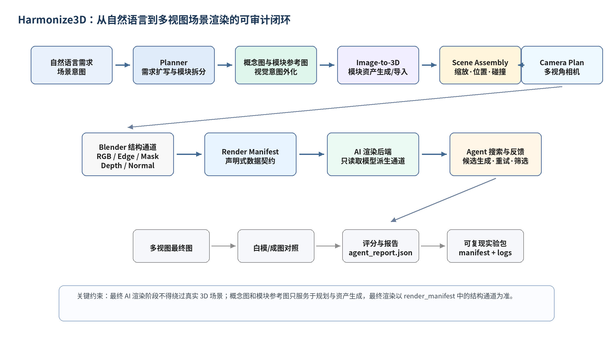

*图 1  Harmonize3D 从自然语言到多视图成图的可审计闭环架构。*

图 2 强调了本文最重要的数据边界。Harmonize3D 允许在早期使用用户文本、概念图和模块参考图帮助规划或生成 3D 资产，但最终 AI 渲染默认不能直接读取这些前期参考。它只能读取由真实 3D 模型或完整场景在指定相机下派生出的 RGB、Edge、Mask、Depth、Normal 等通道。该边界让最终结果具备可追溯性：一旦图像出现结构漂移，系统可以定位问题发生在 3D 模型、相机、通道、AI 候选参数还是 Agent 决策，而不是停留在不可解释的 prompt 偏差。

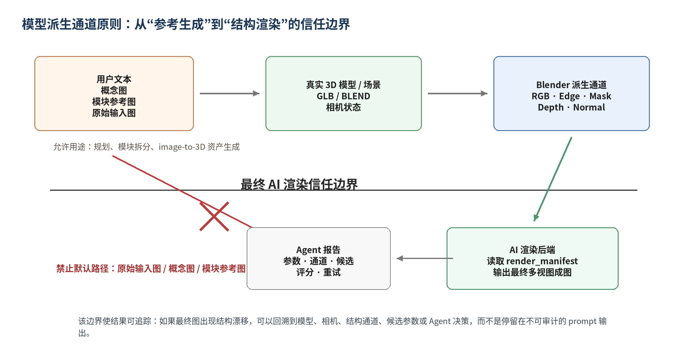

*图 2  模型派生通道原则与最终 AI 渲染信任边界。*

### 4.1 核心模块与职责

| 模块 | 职责 |
| --- | --- |
| Planner | 将一句话需求扩写为对象、场景、材质、相机和输出规格，并决定单对象或全场景路径。 |
| Asset Generator | 调用 Hunyuan3D 或已有模型导入，生成可进入后续渲染的 GLB/BLEND 资产。 |
| Camera Controller | 在 Web 端或自动模式下确定相机状态，并完成 Three.js Y-up 到 Blender Z-up 的坐标转换。 |
| Channel Renderer | 使用 Blender 在固定相机下输出 RGB、Edge、Mask、Depth、Normal 等结构通道。 |
| AI Renderer | 读取 render_manifest 中的模型派生通道，生成材质化、光影和产品摄影风格的候选图。 |
| Agent Evaluator | 根据结构、干净度、模块存在和多视角一致性进行复核，并生成报告、对照图与最终选择。 |

## 5. 方法

### 5.1 需求扩写与任务规划

在单对象模式中，用户输入通常描述一个主体对象，如“未来感白色电动跑车”。在全场景模式中，用户输入可能包含多个对象和空间关系，如“中央是一辆白色低趴电动超跑，周围有蓝色灯带、黑色展示台、两块发光屏幕、机械臂和灰色反光地面”。Planner 的作用是把自然语言中的对象、属性、方位词和输出意图转为结构化计划。例如，名词短语被识别为候选模块，方位词被转为 placement 约束，颜色和材质词被转为 material hint，产品图或发布会等风格词则影响相机和灯光预设。

当前 demo 使用兼容 OpenAI API 的 Qwen planner 进行扩写，同时保留规则 fallback。Planner 的输出不是最终图像 prompt，而是 scene_plan、module_plan、camera_plan 和 prompt_plan 等可检查中间产物。这样做可以把“模型想了什么”转化为“系统将执行什么”。

### 5.2 概念图、模块参考图与 3D 资产生成

对于复杂场景，系统首先生成总体概念图。概念图用于帮助用户和 Agent 明确构图、色彩、模块主次和场景氛围，但它并不直接进入最终渲染。随后系统为每个模块生成独立参考图，使 image-to-3D 阶段能够处理更干净的单一主体。例如，在汽车发布会场景中，主车、展示台、屏幕、机械臂和灯带被拆分为不同模块；每个模块生成白底或简单背景参考图，再进入 image-to-3D 或程序化 fallback。

这一模块化策略的意义在于降低复杂场景一次性生成的难度。直接让 3D 模型生成完整发布会场景通常会造成结构混乱、尺度错误和部件混合；而先拆成模块再装配，可以让每个资产的语义、尺寸和失败策略独立记录。对于主车等 hero object，失败会触发重试或任务失败；对于地面、平台、背景屏幕等简单模块，系统可以退化为程序化几何替代，从而提高闭环稳定性。

### 5.3 相机状态与坐标契约

Harmonize3D 的单对象工作台已经实现真实 GLB/OBJ 预览。用户在浏览器中旋转、缩放、平移并锁定视角后，前端发送 CameraState，其中包括 target、position、azimuth、elevation、distance_scale、ortho_scale 和 viewport_aspect。由于 glTF/Three.js 默认使用 Y-up，而 Blender 使用 Z-up，系统在后端边界统一完成坐标转换，避免前端和后端各自旋转模型造成不可复现误差。

在全自动模式下，Auto Camera Planner 根据对象类型和输出需求自动生成视角。对于汽车和产品展示，默认先生成 hero view、left_30 和 right_30 三个视图，而不是一开始生成八视角。三视图足以验证主体外观和结构一致性，同时保留可控计算成本。

### 5.4 结构通道生成与 render manifest

结构通道是 Harmonize3D 的核心中间表示。Blender 根据固定相机输出白模 RGB、Edge、Mask、Depth、Normal。RGB 提供体积与明暗，Edge 提供轮廓和硬边，Mask 提供前景范围，Depth 和 Normal 提供空间关系与表面朝向。实践表明，在某些图像模型中直接把 Depth/Normal 作为最终参考可能会被误读为材质纹理，导致车身或背景粗糙。因此中期版本默认让最终 AI 渲染读取 RGB + Edge，而让 Mask、Depth、Normal 更多参与评分和复核。

render_manifest 是连接 3D 渲染和 AI 渲染的声明式数据契约。每个视角的相机、通道路径、分辨率、采样数和源模型都会写入 manifest。AI 后端不通过隐式路径读取输入，而是从 manifest 中显式取用通道。这个契约保证了实验可复现，也便于后续接入不同图像模型。

### 5.5 AI 渲染与 MeshLock

AI 渲染阶段的目标不是重新发明 3D 结构，而是在既定结构上完成材质、玻璃、轮胎、灯光和背景质感。前期实验显示，强图像模型视觉质量高，但会根据超跑或产品图先验添加不存在的细节；弱约束模型则更容易出现轮廓漂移和模块缺失。MeshLock 的思想是在图像模型外部建立结构锁定层：首先从 3D 模型获得结构通道，其次生成多个候选，再通过结构评分、多视角复核和失败规则选择或重试。

MeshLock 并不是一个训练出来的新网络，而是一种轻量系统机制。它把“图像模型是否听话”转化为可检测问题：主体是否仍在 mask 内，主要轮廓是否与白模通道接近，是否出现未规划部件，多视角中颜色和结构是否突然变化。这样，图像模型可以继续承担视觉质量提升，而结构约束由外部 3D-grounded Agent 负责。

### 5.6 Agent 评分与反馈

早期评分器使用 edge F1 和 mask IoU 作为候选筛选依据，但 edge F1 对像素级偏移过于敏感。中期版本将评分定位从“严格指标排名”调整为“流程复核与失败分类”。系统保留基础结构指标，同时增加粗糙度、背景干净度、模块存在、多视角一致性和人工复核状态。指标不再作为论文叙事主体，而是作为 Agent 决策的证据：当结构漂移时提高边缘约束或重试；当出现脏纹理时切换 smooth product prompt；当模块缺失时重生该视角或回退到更强结构模式。

## 6. 单对象闭环验证

单对象阶段是 Harmonize3D 的第一个完整闭环。该阶段从单张汽车参考图出发，经过背景去除与方图预处理后进入 Hunyuan3D shape pipeline，生成可加载的 GLB 白模。图 3 展示了前期输入预处理结果，该图用于资产生成，而不直接进入最终 AI 渲染阶段。

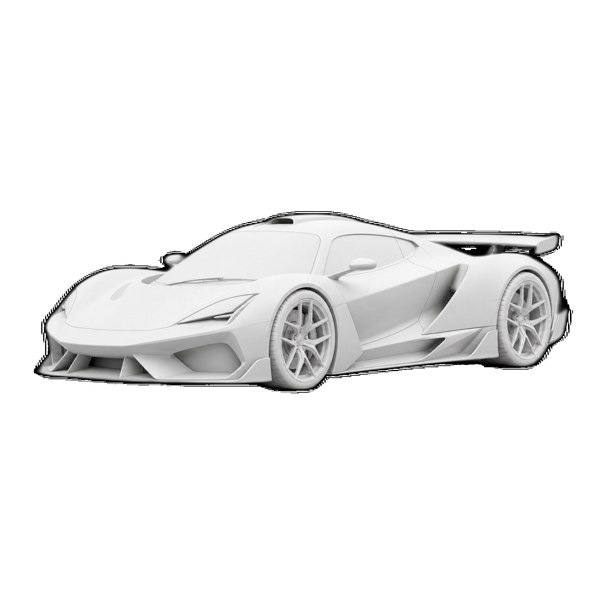

*图 3  单图输入预处理结果，用于 Hunyuan3D 白模生成。*

生成白模后，模型被加载到 Web 工作台。工作台不再是静态状态页，而是使用 Three.js 真实显示 GLB/OBJ，用户可以拖拽、缩放和平移，并在满意构图后锁定相机。图 4 展示了单对象工作台中的真实 3D 预览和右侧白模渲染结果，说明浏览器视角已经可以传递给后端渲染流程。

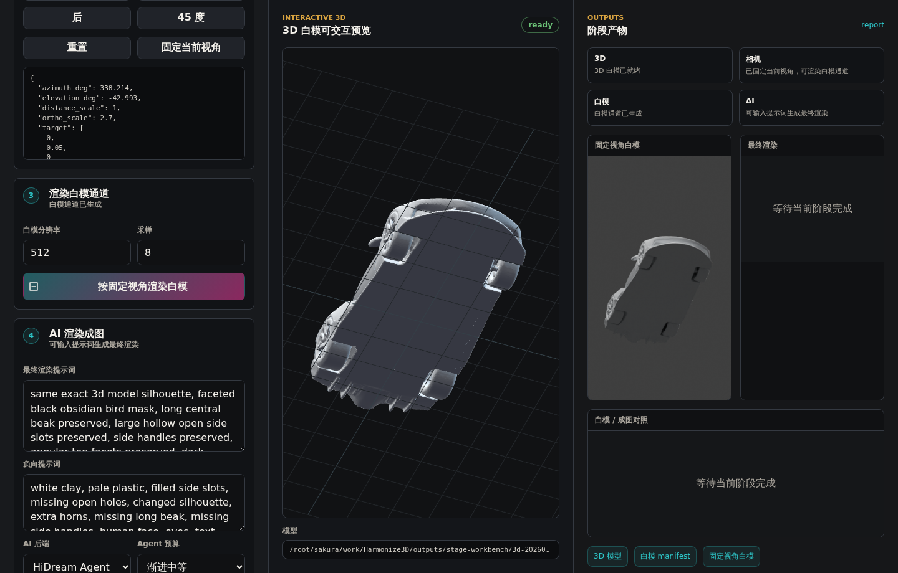

*图 4  单对象工作台中的真实 3D 预览与相机锁定。*

图 5 是锁定视角下的白模 RGB 通道。该通道和对应 Edge 通道构成最终 AI 渲染的主要结构依据。与直接图生图不同，这一步把“参考图像”转化为“真实 3D 模型在指定相机下的结构证据”。

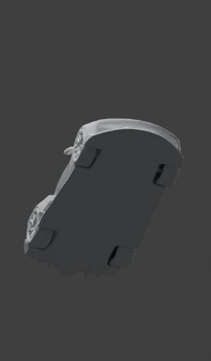

*图 5  锁定相机后的白模 RGB 通道。*

图 6 展示了单对象最终 AI 渲染结果。与白模相比，最终图加入了白色车漆、深色玻璃、轮胎、轮毂、地面反射和摄影棚光影，视觉质量显著提升。图 7 给出了白模和最终图的对照，可以看到主体姿态、前铲、车顶线条和整体低趴比例仍由白模提供约束。

*图 6  单对象 geometry-locked AI 渲染结果。*

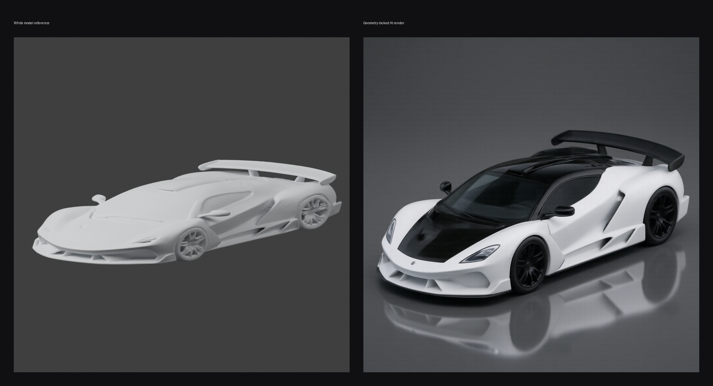

*图 7  单对象白模参考与最终 AI 渲染对照。*

最终图视觉上可用，但局部车灯、尾翼、反光和细节生成会引入额外边缘。这个现象促使项目后续从单一硬指标转向结构遵从、模块存在和多视图一致性的综合复核。

## 7. 多视图一致性与 MeshLock 扩展

单对象闭环跑通后，项目继续进行对象级多视图验证。目标不是立即生成完整场景，而是确认同一 3D 模型在多个相机视角下能否保持稳定外观。图 8 展示了 Flux2 多视图 Agent 输出。三个视角来自同一白模和相机计划，说明系统已经可以把单对象从单图输出扩展为受结构约束的三视图候选。

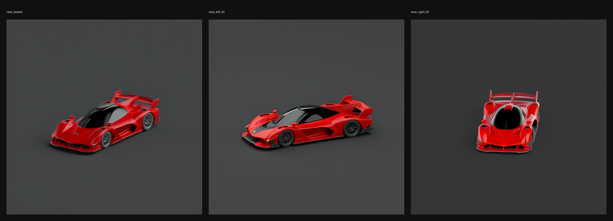

*图 8  Flux2 单对象三视图 Agent 输出。*

在 Flux2 实验中，多视角一致性总分约为 0.85。说明三张图在主体颜色、mask/edge 轮廓和视角变化上具有可度量的一致性。更重要的是，系统能够把每个视角的结构分数和多视角关系写入报告，为后续自动重试提供依据。

为了进一步验证结构锁定的必要性，项目进行了 Z-Image ControlNet + adaptive MeshLock 实验。图 9 展示了 source、canny control、direct output 和 MeshLock 后 final output 的对比。直接输出阶段结构漂移明显，而 MeshLock 后结果更贴近白模轮廓。该实验的核心价值在于证明：一致性和客观性并非是统一的，而是需要进行协调。

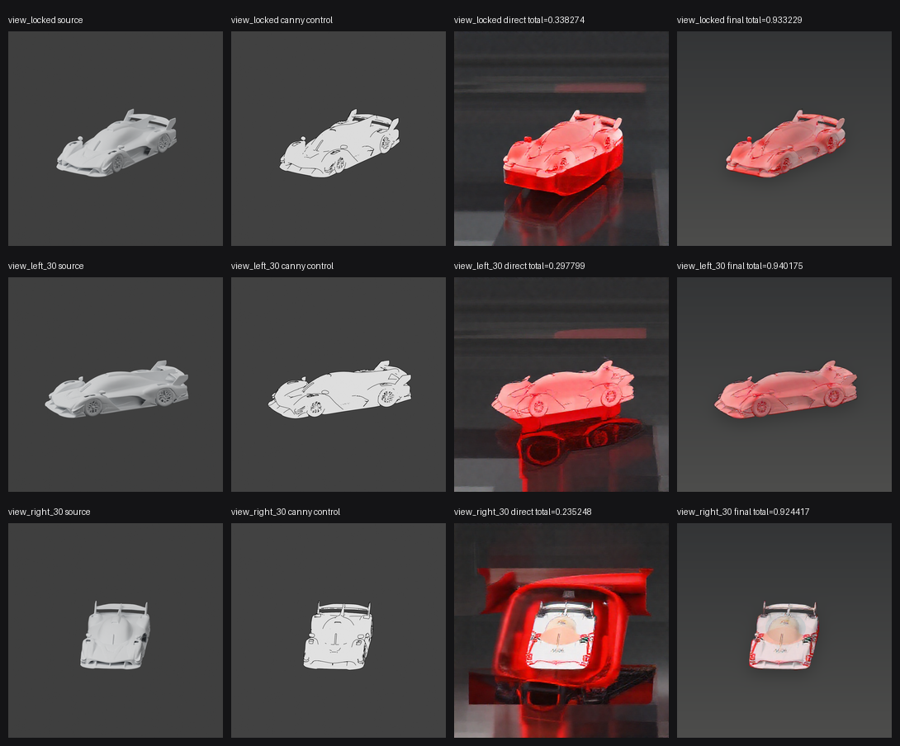

*图 9  Z-Image ControlNet 与 adaptive MeshLock 三视图验证。*

这组实验也改变了项目的技术定位。Harmonize3D 的关键并非不断替换图像模型，而是构建“任意图像模型都必须服从 3D 结构和多视图复核”的外部控制框架。

## 8. Auto Scene Agent：从单对象到全场景原型

当前版本进一步尝试全场景 Auto Scene 流程。用户输入为：“生成一个未来汽车发布会展台，中央是一辆白色低趴电动超跑，周围有蓝色灯带、黑色展示台、两块发光屏幕、机械臂和灰色反光地面，输出三张产品级渲染图。”与单对象任务相比，该请求不仅包含主车，还包含展台、屏幕、机械臂、灯带、地面和灯光氛围。系统必须理解这些元素之间的空间关系，并将其组织成可渲染场景。

最新 Auto Scene 流程首先由 qwen3.7-plus Planner 生成结构化 scene_plan，再根据总体概念图生成独立模块参考图。图 10 展示了本次运行中用于 3D AI 的模块参考图：白色电动超跑、黑色展示台、左/右竖向科技屏幕和工业机械臂。参考图强调单一主体、正视图或清晰轮廓，目的是让后续 image-to-3D 更容易恢复干净几何。

*图 10  最新 Auto Scene 模块参考图，用于后续模块级 image-to-3D。*

全场景阶段最重要的变化是模块化。主车是 hero object，展示台提供空间支撑，竖向屏幕和蓝色灯带提供背景氛围，机械臂作为配角增强发布会语义。最新运行拆分为 5 个核心模块，全部调用 Hunyuan3D 2.1 shape high profile 生成 GLB，没有使用 procedural fallback。模块级评分总分为 0.855333，5 个模块均通过轻量布局评分，但屏幕类模块的几何厚度、比例和遮挡仍暴露出简单 sanity check 不足的问题。

图 11 是最新全场景结构预览，用于检查模块布局、主体覆盖范围和相机下的空间关系。图 12 展示了同一 hero view 派生出的 RGB、Edge、Mask、Depth、Normal 通道。可以看到，全场景阶段仍沿用单对象阶段的核心原则：最终 AI 渲染应当基于完整场景结构通道，而不是直接把概念图或模块参考图喂给最终成图模型。

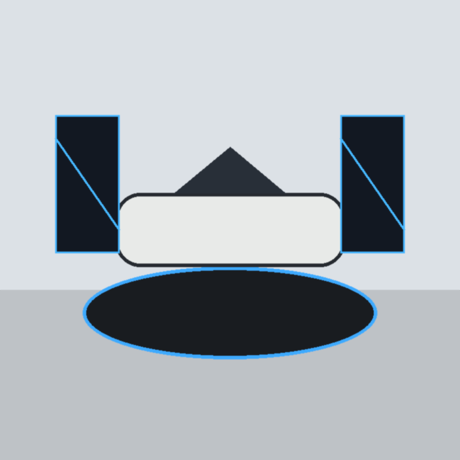

*图 11  最新 Auto Scene 结构预览。*

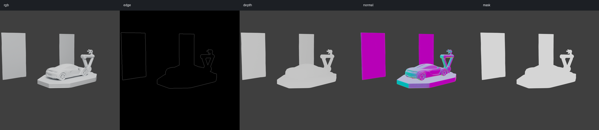

*图 12  最新 Auto Scene hero view 的 RGB、Edge、Mask、Depth、Normal 通道。*

图 13 展示了重新同步后的三视角 Agent 输出，图 14 展示了白模参考与原始最终渲染对照。本次缺陷排查发现，论文中原先展示的三视角图并不是当前工作目录中的最新 Agent 包，而是旧的失败视角和校验中间图，导致页面中出现大面积灰块、遮挡和主体变暗。进一步检查后也确认，不能通过裁切、重排或 bbox 后处理把图像包装成合格成品：最终图必须由 image2 在 Blender 白模通道约束下生成，并通过原始图的白模位置锁。为避免论文资产脱离流程，项目新增并继续使用 `scripts/sync_paper_auto_scene_assets.py`，只从指定 Auto Scene workdir 同步 Agent 原始产物、白模对照图和 position-lock 证据到 `docs/paper_assets` 与 `reports/paper_assets`；同时，成功导入 image2 成品后会自动刷新 contact sheet、白模对照图和概念对比图，避免论文继续引用旧失败图。

*图 13  最新 Auto Scene 三视角 Agent 输出。*

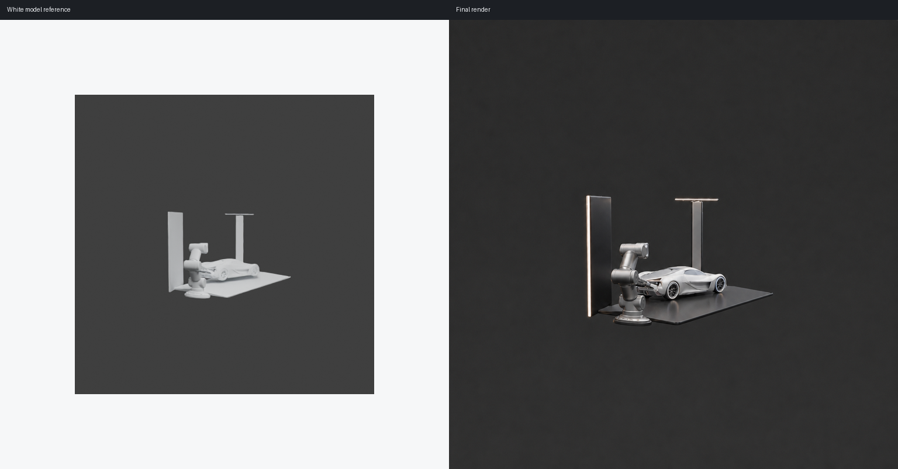

*图 14  最新白模参考与原始最终 AI 渲染对照。*

图 15 是当前复盘结果的关键对比，直接把概念图、Blender 白模通道和最终图放在同一行。它说明全场景流程已经打通“概念规划 -> 模块参考 -> 模块 3D -> 3D 场景组装 -> Blender 白模通道 -> 最终 AI 渲染”，并且最终图已经由当前 workdir、render manifest 和位置锁定报告可复现地生成，而不是依赖人工复制的旧文件。

在当前三视角工作目录中，原始 Codex image2 成品图的 `white_model_position_lock` 已经通过，pass rate 为 `1.0`，平均 total 为 `0.819275`。其中 `view_hero` 的 total 为 `0.855849`，`view_left_30` 为 `0.800278`，`view_right_30` 为 `0.801699`；三视角失败原因均为空。`final_position_retry_plan` 因此返回 `not_needed`，原因是 `white_model_position_lock_passed`。这说明最终图已经按 Blender 白模位置完成渲染，可以作为当前 Agent 流程的合格成品进入论文与 README 展示；同时，`concept_final_comparison` 仍可继续标记概念语义层面的差异，用于后续改善概念图到模块拆解、模块 3D 和场景搭建环节。

*图 15  最新复盘结果：概念图、白模通道与原始最终图对比。*

*图 16  最新结果：3D 白模 hero view。*

图 16 和图 17 进一步显示了当前修复后的结果：白模给出展台结构，image2 成品图在材质化和光影细节上提升了视觉质量，同时通过位置锁保持机械臂、车辆、平台和屏幕的相对关系。后续改进重点从“成品图是否按白模渲染”转向更前面的中间环节：概念图与模块参考图如何约束 3D AI 生成质量、模块白模如何减少低质量资产、场景装配如何让概念语义和最终多视图更加一致。

*图 17  最新结果：原始最终 AI 候选 hero view。*

## 9. 讨论

### 9.1 为什么强调过程模块，而不是单张结果图

在生成式 AI 项目中，单张漂亮结果很容易掩盖流程问题。Harmonize3D 的研究价值在于将结果拆解为可审计过程：输入如何扩写、模块如何识别、3D 资产是否通过 sanity check、相机是否可复现、最终 AI 渲染读取了哪些通道、候选为什么被选择或拒绝。这样的流程设计使系统具备工程可维护性和研究可分析性。

### 9.2 MeshLock 的意义

MeshLock 并非新模型，而是对生成流程的外部约束策略。它承认图像模型强在视觉质量，却弱在严格几何遵从；同时承认传统 3D 渲染强在结构，却弱在快速美学表现。通过让 3D 通道成为最终渲染的权威参考，MeshLock 把两类系统的优势分工结合起来。

### 9.3 从对象到场景的扩展难点

单对象流程主要关心一个 mesh 的形体和相机，而全场景流程还必须处理模块数量、相对尺度、遮挡关系、语义主次和环境一致性。最新 Auto Scene 运行已经把真实模块级 image-to-3D、场景装配和 Blender 白模通道串联起来；本次论文图缺陷排查进一步说明，成品质量不仅取决于 AI 渲染本身，也取决于最终资产是否来自当前 workdir、是否经过白模位置复核、是否被正确写入论文交付物。因此本文把全场景版本界定为可审计中期原型，而不是成熟系统。

## 10. 局限性

• 屏幕、展台等规则几何模块虽然能通过基础 sanity check，但 3D AI 生成结果可能出现厚度、比例和遮挡异常，需要增加面向平板/展台类资产的语义几何检查。

• 相机搜索目前更偏向通用结构分，尚未充分把概念图构图、主车正面可见性和关键模块无遮挡作为硬约束。

• 最终 AI 渲染仍可能偏离白模位置或弱化主车主体，下一步需要把 Codex image2/图像渲染后端的提示词约束、白模通道和概念对比闭环结合起来。

• 评分器仍以轻量 CV 指标为主，尚未充分引入 VLM 语义判断、人工标注基准和系统化失败分类。

• 当前案例集中在汽车展示场景，尚不能证明对任意产品、角色、建筑或室内任务都具备同等稳定性。

• 多视图一致性仍处于三视图 MVP 层面，尚未实现基于 face_id、visibility buffer 或 appearance memory 的严格跨视角表面对应。

## 11. 结论

本文将 Harmonize3D 从项目报告重构为中期研究论文稿，系统总结了其从单对象闭环到全场景原型的发展过程。单对象阶段证明了从单图输入、Hunyuan3D 白模、Web 相机锁定、Blender 结构通道到 AI 渲染的完整链路可行；多视图阶段证明了 MeshLock 式外部结构约束可以显著改善图像模型的结构漂移；全场景阶段则展示了从一句自然语言请求到概念图、模块参考、模块 3D、场景装配、白模通道和最终成图的完整原型链路。

Harmonize3D 的核心贡献不在于某个单独图像模型或 3D 生成模型，而在于建立了一条可审计的 3D-grounded rendering 流程。最新运行表明，系统已经能够记录并复盘每个中间环节，同时也能明确指出最终图与概念图、白模位置不一致的问题。后续工作应围绕更强的模块 3D 质量控制、概念图对齐的相机选择、严格白模位置锁定的最终渲染，以及 VLM 参与的自动复核继续推进。

## 参考文献

[1] Ho, J., Jain, A., and Abbeel, P. Denoising Diffusion Probabilistic Models. NeurIPS, 2020.  
[2] Rombach, R., Blattmann, A., Lorenz, D., Esser, P., and Ommer, B. High-Resolution Image Synthesis with Latent Diffusion Models. CVPR, 2022.  
[3] Zhang, L., Rao, A., and Agrawala, M. Adding Conditional Control to Text-to-Image Diffusion Models. ICCV, 2023.  
[4] Poole, B., Jain, A., Barron, J. T., and Mildenhall, B. DreamFusion: Text-to-3D using 2D Diffusion. ICLR, 2023.  
[5] Liu, R., Wu, R., Van Hoorick, B., Tokmakov, P., Zakharov, S., and Vondrick, C. Zero-1-to-3: Zero-shot One Image to 3D Object. ICCV, 2023.  
[6] Jun, H., and Nichol, A. Shap-E: Generating Conditional 3D Implicit Functions. arXiv, 2023.  
[7] Shi, Y., Wang, P., Ye, J., Long, M., Li, K., and Yang, X. MVDream: Multi-view Diffusion for 3D Generation. ICLR, 2024.  
[8] Liu, Y., Lin, C., Zeng, Z., Long, X., Liu, L., Komura, T., and Wang, W. SyncDreamer: Generating Multiview-consistent Images from a Single-view Image. arXiv, 2023.  
[9] Long, X., Guo, Y.-C., Lin, C., Liu, Y., Dou, Z., Ma, Y., Habermann, M., Theobalt, C., and Wang, W. Wonder3D: Single Image to 3D using Cross-Domain Diffusion. arXiv, 2023.  
[10] Yao, S., Zhao, J., Yu, D., Du, N., Shafran, I., Narasimhan, K., and Cao, Y. ReAct: Synergizing Reasoning and Acting in Language Models. ICLR, 2023.  
[11] Cai, Q., Chen, J., Chen, Y., Li, Y., et al. HiDream-I1: A High-Efficient Image Generative Foundation Model with Sparse Diffusion Transformer. arXiv, 2025.  
[12] Cai, Q., Chen, J., Gao, C., Gong, Z., et al. HiDream-O1-Image: A Natively Unified Image Generative Foundation Model with Pixel-level Unified Transformer. arXiv, 2026.  
[13] Team Hunyuan3D. Hunyuan3D-Omni: A Unified Framework for Controllable Generation of 3D Assets. arXiv, 2025.  
