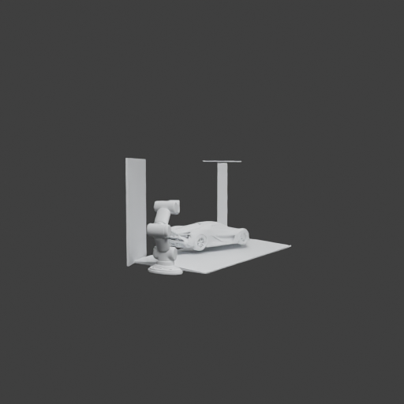

# Harmonize3D 完整技术报告

版本日期：2026-06-22  
项目路径：`/root/sakura/work/Harmonize3D`  
报告类型：工程技术报告 / 阶段性系统说明  
最新论文源文件：`reports/论文.docx`

> 说明：本报告基于当前代码库、README、论文镜像、Auto Scene 最新实现和最近一次回归验证整理生成，不覆盖 `reports/论文.docx`。

## 1. 摘要

Harmonize3D 是一个本地 3D 结构约束 AI 渲染与场景生成工作台。系统的核心目标不是直接让图像模型自由生成一张图片，而是先建立可追踪的 3D 结构、相机状态和渲染通道，再让 AI 图像模型在这些结构约束下完成材质化、光影和最终视觉表现。

项目已经从单对象闭环扩展到模块化 Auto Scene Agent。当前系统支持以下路径：

```text
自然语言需求
-> qwen3.7-plus 需求理解 / 概念规划
-> Codex image2 概念图 handoff/import
-> qwen3.7-plus 概念图审查
-> qwen3.7-plus 模块拆解与单物体提示词
-> Codex image2 模块参考图 handoff/import
-> qwen3.7-plus 模块参考图审查
-> Hunyuan3D 2.1 模块级 image-to-3D
-> 3D 场景装配
-> Blender / procedural 白模通道
-> Codex image2 或本地 AI 最终渲染
-> 自动评分、概念对比、流程审计
```

截至本报告生成时，真实 Auto Scene 规划已经切换为 `qwen3.7-plus` 多模态模型负责，真实运行中规则规划被关闭；概念图、部件图和最终图均可通过 Codex image2 handoff/import 机制进入流程；新增 `auto-scene-audit-image2-flow` 可检查一个 workdir 是否真正符合“模型规划、Codex image2 生图、模型审查、3D AI 生成”的目标链路。

当前仍需明确的限制是：Codex 内置 image2 工具在本线程中可以生成图像，但没有稳定把本次生成产物落盘到 `$CODEX_HOME/generated_images`。因此项目已提供两种承接方式：显式导入命令 `auto-scene-import-image2` 和自动扫描最新产物的 `auto-scene-import-latest-image2`。完整无人值守闭环仍依赖 Codex image2 产物路径稳定暴露。

## 2. 项目目标与边界

### 2.1 技术目标

Harmonize3D 的目标是建立一个可审计的 3D-grounded AI rendering 流程：

1. 用户可以用自然语言或图像提出产品、车辆、展台等视觉生成需求。
2. 系统先生成或导入 3D 结构，而不是直接把最终图交给图像模型自由发挥。
3. 相机、模块、通道、候选、评分和最终图均写入 manifest，便于复盘。
4. AI 图像模型负责视觉表现，3D 模型和渲染通道负责结构约束。
5. Agent 负责规划、工具调度、图像审查、失败定位和迭代。

### 2.2 非目标

当前阶段不把以下内容作为已完成目标：

- 不宣称已经具备工业级全自动场景生成质量。
- 不宣称最终 AI 渲染一定严格服从白模位置。
- 不把旧 DashScope 图像生成结果视为当前 Codex image2 链路完成证据。
- 不把 mock/procedural fallback 当作真实 3D AI 生成成功。
- 不把单次漂亮成图当作流程正确性的证明。

## 3. 系统总体架构

```mermaid
flowchart LR
  U["用户需求"] --> P["qwen3.7-plus<br/>需求理解 / 概念规划"]
  P --> CReq["concept_prompt<br/>Codex image2 request"]
  CReq --> CImg["概念图"]
  CImg --> CReview["qwen3.7-plus<br/>概念审查"]
  CReview --> MPlan["qwen3.7-plus<br/>模块拆解 / reference_prompt"]
  MPlan --> MReq["Codex image2<br/>模块参考图请求"]
  MReq --> MImg["单物体参考图"]
  MImg --> MReview["qwen3.7-plus<br/>模块图审查"]
  MReview --> H3D["Hunyuan3D 2.1<br/>模块 GLB"]
  H3D --> Assemble["3D 场景装配"]
  Assemble --> Channels["Blender / procedural<br/>白模结构通道"]
  Channels --> Final["最终 AI / Codex image2 渲染"]
  Final --> Audit["评分 / 概念对比 / 流程审计"]
```



系统由以下核心层组成：

| 层级 | 主要职责 | 关键产物 |
| --- | --- | --- |
| 需求理解与规划层 | 使用 `qwen3.7-plus` 扩写需求、生成场景计划、概念提示词和相机计划 | `auto_task.json`, `scene_plan.json`, `concept_image_plan.json`, `camera_plan.json` |
| 概念图层 | 使用 Codex image2 生成全局概念图，并交回模型审查 | `concept/global_concept.png`, `concept/concept_review.json` |
| 模块拆解层 | 模型根据概念图和场景计划生成每个物体的单独参考图提示词 | `modules/module_plan.json`, `modules/module_prompt_info.json` |
| 模块参考图层 | 使用 Codex image2 生成纯色背景、正视图、单物体参考图 | `modules/<module_id>/reference.png` |
| 模块审查层 | 将模块参考图返回给 `qwen3.7-plus` 审查，失败时生成修订 prompt | `modules/module_reference_review.json` |
| 3D 资产层 | 使用 Hunyuan3D 2.1 从审查通过的参考图生成模块 GLB | `modules/<module_id>/model.glb`, `metadata.json` |
| 场景装配层 | 按模型给出的尺寸、位置、旋转组装完整 3D 场景 | `scene/final_scene.glb`, `scene/scene_assembly.json` |
| 通道渲染层 | 输出 RGB、edge、mask、depth、normal 等白模通道 | `renders/render_manifest.json` |
| 最终渲染与复核层 | 生成最终图，评分并对比概念图、白模和最终结果 | `final/*`, `reports/*` |

## 4. 关键实现状态

### 4.1 qwen3.7-plus 作为真实 planner

真实 Auto Scene 运行中，`scene_planner` 使用 DashScope 多模态接口：

- 基础地址：`https://dashscope.aliyuncs.com/api/v1`
- 模型：`qwen3.7-plus`
- API Key：`DASHSCOPE_API_KEY`
- 入口函数：`call_model_scene_planner()`

真实运行要求：

- `concept_image_plan.concept_prompt` 必须由模型返回。
- `auto_task.expanded_request` 必须由模型返回。
- 真实运行禁用规则规划。
- `--no-llm` 仅允许 dry-run/mock。

当前状态：已实现。

### 4.2 概念图与模块图不使用本地 fallback

配置中 `reference_generation.provider` 默认走 `external_imagegen`。真实运行缺图时不会自动生成 mock 图或本地图像 fallback，而是写出 Codex image2 request：

- 单图请求：`imagegen_request.json`
- 批量模块请求：`imagegen_batch_request.json`
- handoff 文档：`codex_image2_handoff.md`

请求中包含：

- `provider: codex_builtin_image2`
- `output_path`
- `prompt`
- `source_image`
- `import_command`
- `latest_import_command`
- `codex_image2_handoff`

当前状态：已实现。

### 4.3 Codex image2 导入机制

因为 Codex 内置 image2 不提供可传入输出路径的程序接口，项目提供两种导入命令：

显式导入：

```bash
PYTHONPATH=src .venv/bin/python -m local3dai.cli auto-scene-import-image2 \
  --request outputs/auto_scene/demo_showroom/concept/imagegen_request.json \
  --image /path/to/codex-image2-output.png
```

从 `$CODEX_HOME/generated_images` 扫描最新图片导入：

```bash
PYTHONPATH=src .venv/bin/python -m local3dai.cli auto-scene-import-latest-image2 \
  --request outputs/auto_scene/demo_showroom/concept/imagegen_request.json
```

批量模块或最终图支持 keyed image：

```bash
--image main_vehicle=/path/to/car.png
--image view_hero=/path/to/final.png
```

当前状态：已实现，但依赖 Codex image2 是否稳定落盘。

### 4.4 禁止 negative_prompt

当前 Auto Scene 的 Codex image2 路径不写入 `negative_prompt`。约束被要求写入正向 prompt。例如模块参考图 prompt 会要求：

- strict orthographic front view
- pure solid background
- single centered object
- blank unlabeled surfaces
- object-only catalog cutout
- no perspective / no three-quarter view / no scene environment

当前状态：已实现，并有测试覆盖。

### 4.5 模块图使用概念图作为视觉参考

模块 reference request 会在概念图存在时把 `source_image` 指向 `concept/global_concept.png`。模型会先审查概念图，再根据概念图、场景计划和 few-shot prompt examples 生成每个模块的 `reference_prompt`。

当前状态：已实现。

### 4.6 模块 3D 生成参数

Hunyuan3D 2.1 shape 作为主要模块级 image-to-3D 后端。当前高质量配置会提高：

- steps
- guidance_scale
- octree_resolution
- num_chunks

模块 metadata 中会记录：

- `created_by`
- `hunyuan_profile`
- `hunyuan_shape_overrides`
- `source_reference`
- `model_path`

严格链路下，`created_by` 应为 `hunyuan3d_2_1_shape_from_reviewed_reference`，且 `fallback_used` 应为 false。

当前状态：已实现，真实运行受本地 3D AI 环境和输入图质量影响。

### 4.7 最终图白模位置锁定

最终 Codex image2 请求会包含白模通道作为位置锁：

- `white_model_rgb_position_lock`
- `edge_silhouette_lock`
- `depth_layout_reference`
- `normal_surface_reference`
- `mask_composition_reference`
- `appearance_style_reference_only`

请求说明中明确：概念图只作为风格参考，白模 RGB 和结构通道是位置、构图、尺度和轮廓的锁定依据。

当前状态：已实现 request/handoff；最终图质量仍需持续验证。

## 5. 数据契约与主要文件

Auto Scene workdir 的核心结构如下：

```text
outputs/auto_scene/<task>/
  auto_task.json
  scene_plan.json
  prompt_plan.json
  concept/
    concept_image_plan.json
    concept_prompt.txt
    imagegen_request.json
    codex_image2_handoff.md
    global_concept.png
    concept_review.json
  modules/
    module_plan.json
    module_prompt_info.json
    imagegen_batch_request.json
    codex_image2_batch_handoff.md
    module_reference_review.json
    module_asset_manifest.json
    <module_id>/
      reference_prompt.txt
      reference.png
      reference_manifest.json
      preprocessed.png
      model.glb
      metadata.json
      sanity.json
  scene/
    scene_assembly.json
    final_scene.glb
    scene_preview.png
  cameras/
    camera_plan.json
    camera_search_report.json
  renders/
    render_manifest.json
  final/
    codex_image2_final_request.json
    codex_image2_final_handoff.md
    final_view_hero.png
  reports/
    tool_calls.json
    module_scores.json
    visual_judgement.json
    concept_final_comparison.json
    image2_flow_audit.json
```

这些文件的作用不是简单保存结果，而是建立可审计边界：

- planner 输出和工具执行分离。
- 概念图和模块图只服务规划、审查、3D 生成，不直接作为最终 AI 渲染结构输入。
- 最终渲染应以 render manifest 中的白模通道为结构依据。
- 每个阶段都能从 manifest 追溯输入、输出和失败原因。

## 6. Agent 工具链

`AUTO_SCENE_TOOL_SPECS` 定义了 Auto Scene 的工具执行序列。当前主要工具包括：

| 工具 | 作用 |
| --- | --- |
| `scene_planner` | 调用 qwen3.7-plus 进行需求理解和概念规划 |
| `concept_image_generation` | 根据模型扩写 prompt 发出 Codex image2 概念图请求 |
| `concept_image_review` | 将概念图返回 qwen3.7-plus 审查 |
| `module_prompt_generation` | 让模型根据概念图生成模块级 reference prompt |
| `module_reference_generation` | 发出模块参考图 Codex image2 batch request |
| `module_reference_review` | 将模块图返回模型审查 |
| `module_image_to_3d` | 使用 Hunyuan3D 生成模块 GLB |
| `scene_layout_agent` | 计算模块位置、缩放和旋转 |
| `scene_assembler` | 装配完整 GLB 场景 |
| `camera_candidate_search` | 搜索更合适的 3D 场景视角 |
| `render_white_channels` | 渲染白模和结构通道 |
| `final_image2_render` | 发出最终 Codex image2 白模位置锁请求 |
| `concept_final_comparison` | 对比概念图、白模和最终图 |
| `package_scene_outputs` | 写出报告、contact sheet 和 summary |

所有工具调用会写入 `reports/tool_calls.json`，用于复盘。

## 7. 审计与验证机制

### 7.1 Auto Scene image2 flow audit

新增命令：

```bash
PYTHONPATH=src .venv/bin/python -m local3dai.cli auto-scene-audit-image2-flow \
  --workdir outputs/auto_scene/demo_showroom
```

审计器会检查：

1. planner 是否来自 `qwen3.7-plus` / DashScope 或已存在模型产物。
2. 真实运行是否关闭规则规划。
3. 概念 prompt 是否来自模型。
4. 概念图是否由 Codex image2/imported image2 提供。
5. 概念图相关 manifest 是否不含 `negative_prompt`。
6. 概念图是否由模型审查并通过。
7. 模块 prompt 是否由模型生成。
8. 模块 plan 是否不含 `negative_prompt`。
9. 模块参考图是否由 Codex image2/imported image2 提供。
10. 模块参考图是否不含 `negative_prompt`。
11. 模块参考图是否由模型审查并通过。
12. 审查通过的模块参考图是否进入 Hunyuan3D，且未使用 procedural fallback。

审计结果写入：

```text
reports/image2_flow_audit.json
```

### 7.2 最近验证记录

最近一次代码回归：

```text
tests/test_auto_scene.py: 38 passed
full pytest: 80 passed
```

最近一次真实 pending smoke：

```text
status: awaiting_external_imagegen
stage: concept_image_generation
model: qwen3.7-plus
plan_source: model_only
rule_planning: disabled_for_real_runs
provider: codex_builtin_image2
negative_prompt_present: False
```

对旧 workdir `outputs/auto_scene/full_current_concept_source_v1` 运行严格审计时返回 fail，原因包括旧链路使用 DashScope imagegen、旧 manifest 含 `negative_prompt`、部分审查状态不是 pass。这是预期结果，说明审计器不会把旧流程误判为当前目标完成。

## 8. 关键实验结果与当前质量

README 中记录的 2026-06-18 Auto Scene 运行验证了完整模块化链路：

```text
concept planning -> module references -> module 3D -> 3D scene assembly -> Blender white-model channels -> final AI render
```

该运行结果状态为 `needs_review`，不是 `pass`。关键指标：

- 生成 5 个 Hunyuan3D 2.1 high-profile 模块 GLB。
- 无 procedural fallback。
- module presence score: `0.855333`
- multiview score: `0.789947`
- minimum structure review score: `0.551932`
- concept/final comparison 仍失败 `white_hero_presence`
- final image central white subject ratio 约 `0.000431`

主要结论：

- 模块化 3D 场景链路已经能跑通。
- 模块级 Hunyuan3D 生成已经不再停留在 mock。
- 最终图仍可能不严格符合白模位置和概念图主车视角。
- 相机搜索、屏幕/面板类模块质量控制、最终图白模位置锁仍是重点改进方向。

示例图：





## 9. 运行方式

### 9.1 环境检查

```bash
cd /root/sakura/work/Harmonize3D
PYTHONPATH=src .venv/bin/python -m local3dai.cli auto-doctor --allow-not-ready
```

### 9.2 Auto Scene 真实 planner pending smoke

```bash
PYTHONPATH=src .venv/bin/python -m local3dai.cli auto-scene \
  --request "生成一个未来汽车发布会展台，中央是一辆白色低趴电动超跑，周围有蓝色灯带、黑色展示台、两块发光屏幕、机械臂和灰色反光地面，输出三张产品级渲染图。" \
  --output outputs/auto_scene/demo_showroom \
  --views 1 \
  --quality fast \
  --geometry strict \
  --style exhibition \
  --candidates 1 \
  --max-retries 0 \
  --render-backend procedural
```

如果停在 `awaiting_external_imagegen`，说明真实 planner 已输出 concept prompt，下一步需要 Codex image2 生成并导入概念图。

### 9.3 导入 Codex image2 概念图

```bash
PYTHONPATH=src .venv/bin/python -m local3dai.cli auto-scene-import-image2 \
  --request outputs/auto_scene/demo_showroom/concept/imagegen_request.json \
  --image /path/to/generated-concept.png
```

或：

```bash
PYTHONPATH=src .venv/bin/python -m local3dai.cli auto-scene-import-latest-image2 \
  --request outputs/auto_scene/demo_showroom/concept/imagegen_request.json
```

### 9.4 导入模块 batch

```bash
PYTHONPATH=src .venv/bin/python -m local3dai.cli auto-scene-import-image2 \
  --request outputs/auto_scene/demo_showroom/modules/imagegen_batch_request.json \
  --image main_vehicle=/path/to/main_vehicle.png \
  --image display_platform=/path/to/platform.png
```

### 9.5 审计完整链路

```bash
PYTHONPATH=src .venv/bin/python -m local3dai.cli auto-scene-audit-image2-flow \
  --workdir outputs/auto_scene/demo_showroom
```

## 10. 风险与限制

### 10.1 Codex image2 产物路径限制

当前最大工程限制是 Codex 内置 image2 在本线程中未稳定把新生成图片写入可扫描路径。项目已支持 `$CODEX_HOME/generated_images` 自动扫描，但如果 Codex 不落盘，仍需显式导入图片路径。

影响：

- 无法在 Python CLI 内部直接调用 Codex built-in image2。
- 无法完全无人值守完成 concept/module/final 三段图像生成。
- 但 handoff/import 已经保证路径、prompt、source image 和后续模型审查都可追踪。

### 10.2 最终图白模位置不稳定

最终图可能偏离白模：

- 主车被弱化或变暗。
- 屏幕/平台遮挡主车。
- 相机角度与概念图不一致。
- AI 模型增加未规划结构。

已采取措施：

- 最终 Codex image2 request 增加白模 RGB、edge、depth、normal、mask 输入角色。
- prompt 中强调 exact geometry、same screen-space module positions、same object scale。
- 增加 concept_final_comparison 和 image2 flow audit。

仍需继续：

- 使用视觉模型对最终图与白模位置做更严格的自动审查。
- 将相机搜索目标改为“主车正面可见 + 概念图构图相似 + 模块无遮挡”。

### 10.3 模块 3D 质量不均

Hunyuan3D 对车辆类效果相对可用，但对薄屏幕、灯带、平台等规则几何可能生成厚度异常、弯曲或细节噪声。

需要补强：

- 面板类 mesh sanity check。
- 模块类别专用 3D 生成 prompt。
- 对简单规则几何允许使用确定性 mesh generator，但必须在审计中明确标记为非 3D AI。

### 10.4 评分器仍偏轻量

当前评分主要基于轻量 CV 指标和 manifest 证据。后续需要引入 VLM 审查：

- 白模与最终图主体位置是否一致。
- 概念图关键元素是否保留。
- 模块是否缺失或被遮挡。
- 是否出现文字、logo、人物或额外对象。

## 11. 后续路线图

### 近期

1. 让 Codex image2 产物路径稳定进入 `$CODEX_HOME/generated_images` 或提供可读 output artifact。
2. 用真实 Codex image2 概念图跑通：concept -> model review -> module prompts。
3. 用真实 Codex image2 模块图跑通：module references -> model review -> Hunyuan3D。
4. 对通过审计的 workdir 生成一份新的报告图集。

### 中期

1. 引入 VLM 对最终图和白模通道做位置一致性审查。
2. 改进 camera search，以概念图构图和主车可见性为硬约束。
3. 增加屏幕、灯带、平台等规则模块的 mesh sanity。
4. 建立 Auto Scene 失败类型 taxonomy。

### 长期

1. 将 Auto Scene 从单案例扩展到产品、室内、建筑、游戏资产等多类场景。
2. 引入 face/part-level visibility buffer，提升多视角一致性。
3. 建立人工标注 benchmark，评估结构遵从、模块完整性和概念一致性。
4. 把 handoff/import 机制升级为可编排的跨工具 asset bus。

## 12. 结论

Harmonize3D 当前已经形成一条清晰的工程路线：用 `qwen3.7-plus` 负责需求理解和多模态审查，用 Codex image2 负责概念图与模块参考图生成，用 Hunyuan3D 负责模块级 3D 资产生成，用 Blender/程序化渲染负责白模结构通道，用最终 AI/Codex image2 负责成品图表现，并用审计器验证流程是否真实符合目标。

项目的价值不在于单张图是否足够好看，而在于每一步都能被记录、复盘和修正。最新实现已经把“概念规划 -> 模块参考 -> 模块 3D -> 3D 场景组装 -> 白模通道 -> 最终渲染”的工程框架搭起来，并进一步把 Codex image2 的外部 handoff/import 变成了可审计的数据契约。当前主要未完成点是 Codex 内置 image2 的产物路径自动回填，以及最终图对白模位置的强约束。下一阶段应围绕这两个问题继续收敛。

